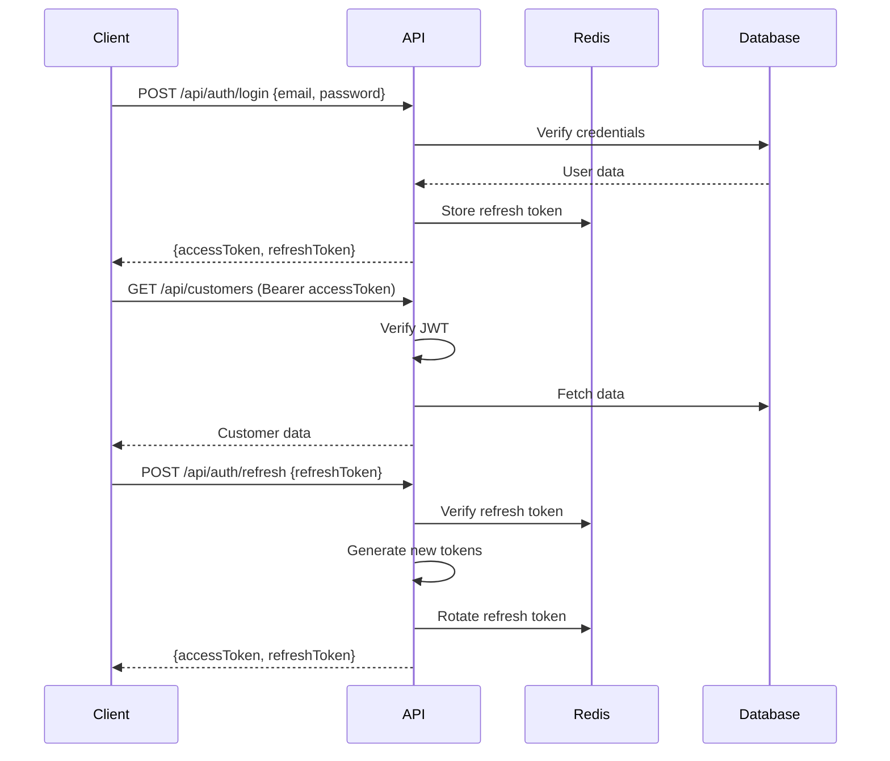

# API Architecture & Design

## Overview

The KHS CRM API is designed as a RESTful service that supports offline-first mobile clients with robust synchronization capabilities. The architecture emphasizes consistency, performance, and developer experience while maintaining security and scalability.

## API Design Principles

1. **RESTful Design**: Resource-based URLs with standard HTTP methods
2. **Consistent Response Format**: Predictable structure for all responses
3. **Stateless**: No server-side session state, JWT-based authentication
4. **Versioning**: API version in headers, not URLs
5. **HATEOAS**: Hypermedia links for resource navigation
6. **Idempotency**: Safe retry for all non-GET operations

## API Structure

### Base URL Structure

```
Production:  https://api.khscrm.com
Staging:     https://api-staging.khscrm.com
Development: http://localhost:3001
```

### URL Patterns

```
/api/auth/{action}              # Authentication endpoints
/api/customers/{id?}/{action?}  # Customer resources
/api/jobs/{id?}/{action?}       # Job resources
/api/materials/{id?}            # Material resources
/api/sync/{action}              # Synchronization endpoints
/api/users/{id?}                # User management (admin only)
```

## Authentication & Authorization

### JWT Token Structure

```typescript
interface AccessTokenPayload {
  sub: string;        // User ID
  email: string;      // User email
  role: 'OWNER' | 'WORKER';
  iat: number;        // Issued at
  exp: number;        // Expires at (15 minutes)
}

interface RefreshTokenPayload {
  sub: string;        // User ID
  jti: string;        // Token ID
  iat: number;        // Issued at
  exp: number;        // Expires at (30 days)
}
```

### Authentication Flow



### Authorization Matrix

| Endpoint | Owner | Worker | Public |
|----------|-------|--------|--------|
| GET /api/customers | ✓ | ✓ | ✗ |
| POST /api/customers | ✓ | ✓ | ✗ |
| PUT /api/customers/:id | ✓ | ✗ | ✗ |
| DELETE /api/customers/:id | ✓ | ✗ | ✗ |
| GET /api/jobs | ✓ | ✓* | ✗ |
| POST /api/jobs | ✓ | ✗ | ✗ |
| PUT /api/jobs/:id/status | ✓ | ✓* | ✗ |
| POST /api/materials | ✓ | ✓* | ✗ |
| PUT /api/materials/:id | ✓ | ✓* | ✗ |
| GET /api/users | ✓ | ✗ | ✗ |

*Workers can only access/modify their assigned jobs

## Request/Response Formats

### Standard Request Headers

```http
Content-Type: application/json
Accept: application/json
Authorization: Bearer {jwt_token}
X-API-Version: 1.0
X-Client-Version: 1.0.0
X-Request-ID: {uuid}
```

### Standard Success Response

```typescript
interface SuccessResponse<T> {
  data: T;
  meta?: {
    timestamp: string;
    version: string;
    requestId: string;
  };
  links?: {
    self: string;
    next?: string;
    prev?: string;
  };
}
```

### Standard Error Response

```typescript
interface ErrorResponse {
  error: {
    code: string;          // Machine-readable error code
    message: string;       // Human-readable message
    details?: any;         // Additional error context
    timestamp: string;
    requestId: string;
  };
}
```

### Pagination Response

```typescript
interface PaginatedResponse<T> {
  data: T[];
  pagination: {
    page: number;
    pageSize: number;
    totalItems: number;
    totalPages: number;
    hasNext: boolean;
    hasPrev: boolean;
  };
  links: {
    self: string;
    first: string;
    last: string;
    next?: string;
    prev?: string;
  };
}
```

## Core API Endpoints

### Authentication Endpoints

#### POST /api/auth/login
```typescript
// Request
{
  email: string;
  password: string;
  rememberMe?: boolean;
}

// Response
{
  data: {
    accessToken: string;
    refreshToken: string;
    expiresIn: number;
    user: {
      id: string;
      email: string;
      name: string;
      role: string;
    };
  }
}
```

#### POST /api/auth/refresh
```typescript
// Request
{
  refreshToken: string;
}

// Response
{
  data: {
    accessToken: string;
    refreshToken: string;
    expiresIn: number;
  }
}
```

#### POST /api/auth/logout
```typescript
// Request
{
  refreshToken: string;
}

// Response
{
  data: {
    message: "Logged out successfully";
  }
}
```

### Customer Endpoints

#### GET /api/customers
```typescript
// Query Parameters
{
  page?: number;          // Default: 1
  pageSize?: number;      // Default: 20, Max: 100
  search?: string;        // Search in name, phone, address
  isArchived?: boolean;   // Filter by archive status
  sortBy?: 'name' | 'createdAt' | 'updatedAt';
  sortOrder?: 'asc' | 'desc';
}

// Response
PaginatedResponse<Customer>
```

#### GET /api/customers/:id
```typescript
// Response
{
  data: {
    id: string;
    name: string;
    phone?: string;
    email?: string;
    address: string;
    notes?: string;
    isArchived: boolean;
    createdAt: string;
    updatedAt: string;
    jobs?: Job[];        // Optional expansion
    jobCount: number;
    lastJobDate?: string;
  }
}
```

#### POST /api/customers
```typescript
// Request
{
  name: string;         // Required
  phone?: string;
  email?: string;
  address: string;      // Required
  notes?: string;
}

// Response
{
  data: Customer;
}
```

#### PUT /api/customers/:id
```typescript
// Request (all fields optional)
{
  name?: string;
  phone?: string;
  email?: string;
  address?: string;
  notes?: string;
  isArchived?: boolean;
}

// Response
{
  data: Customer;
}
```

### Job Endpoints

#### GET /api/jobs
```typescript
// Query Parameters
{
  page?: number;
  pageSize?: number;
  status?: JobStatus | JobStatus[];
  customerId?: string;
  assignedUserId?: string;    // For workers: auto-filters to self
  startDate?: string;         // ISO date
  endDate?: string;           // ISO date
  search?: string;            // Search in title, description
  includeCompleted?: boolean; // Default: false
}

// Response
PaginatedResponse<JobWithRelations>
```

#### GET /api/jobs/:id
```typescript
// Query Parameters
{
  expand?: ('customer' | 'assignments' | 'materials' | 'history')[];
}

// Response
{
  data: {
    id: string;
    title: string;
    description?: string;
    status: JobStatus;
    startDate?: string;
    endDate?: string;
    notes?: string;
    customerId: string;
    customer?: Customer;          // If expanded
    assignments?: Assignment[];   // If expanded
    materials?: Material[];       // If expanded
    statusHistory?: StatusLog[];  // If expanded
    createdAt: string;
    updatedAt: string;
  }
}
```

#### POST /api/jobs
```typescript
// Request
{
  title: string;              // Required
  description?: string;
  customerId: string;         // Required
  status?: JobStatus;         // Default: 'NOT_STARTED'
  startDate?: string;
  endDate?: string;
  notes?: string;
  assignedUserIds?: string[]; // Assign on creation
}

// Response
{
  data: Job;
}
```

#### PUT /api/jobs/:id
```typescript
// Request
{
  title?: string;
  description?: string;
  status?: JobStatus;
  startDate?: string;
  endDate?: string;
  notes?: string;
}

// Response
{
  data: Job;
}
```

#### PUT /api/jobs/:id/status
```typescript
// Request
{
  status: JobStatus;
  notes?: string;     // Status change reason
}

// Response
{
  data: {
    job: Job;
    statusChange: {
      from: JobStatus;
      to: JobStatus;
      changedAt: string;
      changedBy: string;
    };
  }
}
```

#### POST /api/jobs/:id/assign
```typescript
// Request
{
  userIds: string[];    // User IDs to assign
  replaceExisting?: boolean; // Default: false
}

// Response
{
  data: {
    job: Job;
    assignments: Assignment[];
  }
}
```

### Material Endpoints

#### GET /api/jobs/:jobId/materials
```typescript
// Query Parameters
{
  purchased?: boolean;
  includeDeleted?: boolean;  // Default: false
}

// Response
{
  data: Material[];
}
```

#### POST /api/jobs/:jobId/materials
```typescript
// Request (single)
{
  itemName: string;     // Required
  quantity: number;     // Required, > 0
  unit?: string;        // Default: 'each'
  notes?: string;
}

// Request (bulk)
{
  materials: Array<{
    itemName: string;
    quantity: number;
    unit?: string;
    notes?: string;
  }>;
}

// Response
{
  data: Material | Material[];
}
```

#### PUT /api/materials/:id
```typescript
// Request
{
  itemName?: string;
  quantity?: number;
  unit?: string;
  purchased?: boolean;
  notes?: string;
}

// Response
{
  data: Material;
}
```

#### PUT /api/materials/bulk-update
```typescript
// Request
{
  materialIds: string[];
  updates: {
    purchased?: boolean;
  };
}

// Response
{
  data: {
    updated: number;
    materials: Material[];
  };
}
```

### Sync Endpoints

#### POST /api/sync/push
```typescript
// Request
{
  operations: Array<{
    id: string;           // Client operation ID
    timestamp: string;    // Client timestamp
    operation: 'create' | 'update' | 'delete';
    entity: 'customer' | 'job' | 'material';
    entityId?: string;    // For update/delete
    data?: any;           // For create/update
  }>;
  lastSyncTimestamp?: string;
}

// Response
{
  data: {
    processed: number;
    failed: Array<{
      operationId: string;
      error: string;
    }>;
    conflicts: Array<{
      operationId: string;
      serverVersion: any;
      resolution: 'server_wins' | 'client_wins';
    }>;
    serverTimestamp: string;
  };
}
```

#### GET /api/sync/pull
```typescript
// Query Parameters
{
  since?: string;         // ISO timestamp
  entities?: string[];    // Filter entities
  limit?: number;         // Max records per entity
}

// Response
{
  data: {
    customers: Customer[];
    jobs: Job[];
    materials: Material[];
    deletions: Array<{
      entity: string;
      id: string;
      deletedAt: string;
    }>;
    serverTimestamp: string;
  };
}
```

## Error Handling

### Error Codes

```typescript
enum ErrorCode {
  // Authentication errors (401)
  UNAUTHORIZED = 'UNAUTHORIZED',
  TOKEN_EXPIRED = 'TOKEN_EXPIRED',
  TOKEN_INVALID = 'TOKEN_INVALID',
  
  // Authorization errors (403)
  FORBIDDEN = 'FORBIDDEN',
  INSUFFICIENT_PERMISSIONS = 'INSUFFICIENT_PERMISSIONS',
  
  // Validation errors (400)
  VALIDATION_ERROR = 'VALIDATION_ERROR',
  INVALID_REQUEST = 'INVALID_REQUEST',
  MISSING_REQUIRED_FIELD = 'MISSING_REQUIRED_FIELD',
  
  // Resource errors (404)
  NOT_FOUND = 'NOT_FOUND',
  RESOURCE_NOT_FOUND = 'RESOURCE_NOT_FOUND',
  
  // Conflict errors (409)
  CONFLICT = 'CONFLICT',
  DUPLICATE_RESOURCE = 'DUPLICATE_RESOURCE',
  SYNC_CONFLICT = 'SYNC_CONFLICT',
  
  // Rate limiting (429)
  RATE_LIMIT_EXCEEDED = 'RATE_LIMIT_EXCEEDED',
  
  // Server errors (500)
  INTERNAL_ERROR = 'INTERNAL_ERROR',
  DATABASE_ERROR = 'DATABASE_ERROR',
  SERVICE_UNAVAILABLE = 'SERVICE_UNAVAILABLE',
}
```

### Error Response Examples

```json
// 400 Bad Request
{
  "error": {
    "code": "VALIDATION_ERROR",
    "message": "Invalid request data",
    "details": {
      "fields": {
        "email": "Invalid email format",
        "phone": "Phone number must be 10 digits"
      }
    },
    "timestamp": "2024-01-01T00:00:00Z",
    "requestId": "req_abc123"
  }
}

// 401 Unauthorized
{
  "error": {
    "code": "TOKEN_EXPIRED",
    "message": "Access token has expired",
    "timestamp": "2024-01-01T00:00:00Z",
    "requestId": "req_abc123"
  }
}

// 429 Too Many Requests
{
  "error": {
    "code": "RATE_LIMIT_EXCEEDED",
    "message": "Too many requests, please try again later",
    "details": {
      "limit": 100,
      "window": "1 minute",
      "retryAfter": 45
    },
    "timestamp": "2024-01-01T00:00:00Z",
    "requestId": "req_abc123"
  }
}
```

## API Versioning

### Version Strategy

- Version in header: `X-API-Version: 1.0`
- Default to latest stable version
- Deprecation warnings in headers
- 6-month deprecation notice
- Breaking changes require new major version

### Version Response Headers

```http
X-API-Version: 1.0
X-API-Deprecated: true
X-API-Sunset: 2024-07-01
X-API-Deprecation-Link: https://docs.khscrm.com/api/v2
```

## Rate Limiting

### Rate Limit Strategy

| Endpoint Type | Authenticated | Rate Limit |
|--------------|---------------|------------|
| Auth endpoints | No | 5 req/min |
| Read endpoints | Yes | 100 req/min |
| Write endpoints | Yes | 50 req/min |
| Sync endpoints | Yes | 20 req/min |

### Rate Limit Headers

```http
X-RateLimit-Limit: 100
X-RateLimit-Remaining: 95
X-RateLimit-Reset: 1640995200
X-RateLimit-Retry-After: 60
```

## Performance Optimization

### Response Compression

- Gzip compression for responses > 1KB
- Brotli for supported clients
- Exclude already compressed formats (images, PDFs)

### Caching Strategy

```http
# Static resources (1 year)
Cache-Control: public, max-age=31536000, immutable

# API responses (5 minutes)
Cache-Control: private, max-age=300, must-revalidate

# User-specific data (no cache)
Cache-Control: private, no-cache, no-store, must-revalidate
```

### ETags

```http
# Response
ETag: "33a64df551425fcc55e4d42a148795d9f25f89d4"

# Conditional request
If-None-Match: "33a64df551425fcc55e4d42a148795d9f25f89d4"

# 304 Not Modified (no body)
```

## API Security

### Security Headers

```http
Strict-Transport-Security: max-age=31536000; includeSubDomains
X-Content-Type-Options: nosniff
X-Frame-Options: DENY
X-XSS-Protection: 1; mode=block
Content-Security-Policy: default-src 'self'
```

### Input Validation

```typescript
// Zod schema example
const createCustomerSchema = z.object({
  name: z.string().min(1).max(255),
  phone: z.string().regex(/^\d{10}$/).optional(),
  email: z.string().email().optional(),
  address: z.string().min(1).max(500),
  notes: z.string().max(1000).optional(),
});

// Validation middleware
const validate = (schema: ZodSchema) => {
  return (req: Request, res: Response, next: NextFunction) => {
    try {
      schema.parse(req.body);
      next();
    } catch (error) {
      res.status(400).json({
        error: {
          code: 'VALIDATION_ERROR',
          message: 'Invalid request data',
          details: error.errors,
        },
      });
    }
  };
};
```

### SQL Injection Prevention

- Parameterized queries via Prisma ORM
- Input sanitization
- Principle of least privilege database user

## Monitoring & Logging

### Request Logging

```json
{
  "timestamp": "2024-01-01T00:00:00Z",
  "requestId": "req_abc123",
  "method": "GET",
  "path": "/api/customers",
  "userId": "user_123",
  "statusCode": 200,
  "duration": 45,
  "userAgent": "KHS-CRM-Mobile/1.0.0",
  "ip": "192.168.1.1"
}
```

### Error Logging

```json
{
  "timestamp": "2024-01-01T00:00:00Z",
  "requestId": "req_abc123",
  "level": "error",
  "error": {
    "message": "Database connection failed",
    "stack": "...",
    "code": "ECONNREFUSED"
  },
  "context": {
    "userId": "user_123",
    "endpoint": "/api/customers",
    "method": "GET"
  }
}
```

### Metrics

- Request rate by endpoint
- Response time percentiles (p50, p95, p99)
- Error rate by type
- Active users
- Database query performance

## API Testing

### Integration Tests

```typescript
describe('Customer API', () => {
  test('GET /api/customers returns paginated results', async () => {
    const response = await request(app)
      .get('/api/customers')
      .set('Authorization', `Bearer ${token}`)
      .query({ page: 1, pageSize: 10 });
      
    expect(response.status).toBe(200);
    expect(response.body.data).toHaveLength(10);
    expect(response.body.pagination).toMatchObject({
      page: 1,
      pageSize: 10,
      hasNext: true,
    });
  });
});
```

### Contract Testing

```typescript
// Pact consumer test
describe('Customer Service', () => {
  test('get customer by id', async () => {
    await provider.addInteraction({
      state: 'a customer exists',
      uponReceiving: 'a request for customer',
      withRequest: {
        method: 'GET',
        path: '/api/customers/123',
      },
      willRespondWith: {
        status: 200,
        body: like({
          data: {
            id: '123',
            name: 'John Doe',
            address: '123 Main St',
          },
        }),
      },
    });
  });
});
```

## SDK Generation

### OpenAPI Specification

```yaml
openapi: 3.0.0
info:
  title: KHS CRM API
  version: 1.0.0
  description: Construction CRM API
servers:
  - url: https://api.khscrm.com
paths:
  /api/customers:
    get:
      summary: List customers
      parameters:
        - name: page
          in: query
          schema:
            type: integer
            default: 1
      responses:
        200:
          description: Success
          content:
            application/json:
              schema:
                $ref: '#/components/schemas/CustomerList'
```

### Client SDK

```typescript
// Auto-generated TypeScript client
export class KhsCrmClient {
  constructor(private apiKey: string) {}
  
  async getCustomers(params?: GetCustomersParams): Promise<CustomerList> {
    return this.request('GET', '/api/customers', { params });
  }
  
  async createCustomer(data: CreateCustomerData): Promise<Customer> {
    return this.request('POST', '/api/customers', { data });
  }
}
```