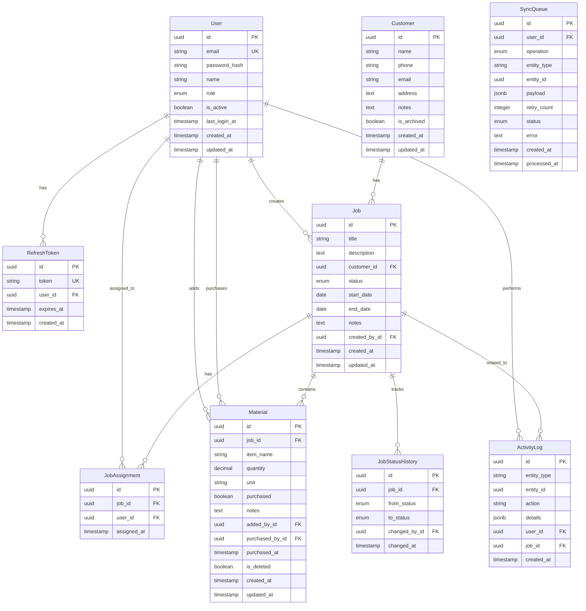

# Database Schema Design

## Overview

The KHS CRM database is designed with PostgreSQL to support offline-first synchronization, audit trails, and efficient mobile queries. The schema prioritizes data integrity, query performance, and sync reliability.

## Entity Relationship Diagram



## Detailed Schema Definition

### Users Table

```sql
CREATE TABLE users (
    id UUID PRIMARY KEY DEFAULT gen_random_uuid(),
    email VARCHAR(255) UNIQUE NOT NULL,
    password_hash VARCHAR(255) NOT NULL,
    name VARCHAR(100) NOT NULL,
    role VARCHAR(20) NOT NULL CHECK (role IN ('OWNER', 'WORKER')),
    is_active BOOLEAN DEFAULT true,
    last_login_at TIMESTAMP WITH TIME ZONE,
    created_at TIMESTAMP WITH TIME ZONE DEFAULT CURRENT_TIMESTAMP,
    updated_at TIMESTAMP WITH TIME ZONE DEFAULT CURRENT_TIMESTAMP
);

CREATE INDEX idx_users_email ON users(email);
CREATE INDEX idx_users_role ON users(role) WHERE is_active = true;
```

### Customers Table

```sql
CREATE TABLE customers (
    id UUID PRIMARY KEY DEFAULT gen_random_uuid(),
    name VARCHAR(255) NOT NULL,
    phone VARCHAR(20),
    email VARCHAR(255),
    address TEXT NOT NULL,
    notes TEXT,
    is_archived BOOLEAN DEFAULT false,
    created_at TIMESTAMP WITH TIME ZONE DEFAULT CURRENT_TIMESTAMP,
    updated_at TIMESTAMP WITH TIME ZONE DEFAULT CURRENT_TIMESTAMP
);

CREATE INDEX idx_customers_name ON customers(name);
CREATE INDEX idx_customers_phone ON customers(phone) WHERE phone IS NOT NULL;
CREATE INDEX idx_customers_address_gin ON customers USING gin(to_tsvector('english', address));
CREATE INDEX idx_customers_active ON customers(is_archived, updated_at DESC);
```

### Jobs Table

```sql
CREATE TABLE jobs (
    id UUID PRIMARY KEY DEFAULT gen_random_uuid(),
    title VARCHAR(255) NOT NULL,
    description TEXT,
    customer_id UUID NOT NULL REFERENCES customers(id),
    status VARCHAR(30) NOT NULL DEFAULT 'NOT_STARTED',
    start_date DATE,
    end_date DATE,
    notes TEXT,
    created_by_id UUID NOT NULL REFERENCES users(id),
    created_at TIMESTAMP WITH TIME ZONE DEFAULT CURRENT_TIMESTAMP,
    updated_at TIMESTAMP WITH TIME ZONE DEFAULT CURRENT_TIMESTAMP,
    
    CONSTRAINT check_job_status CHECK (
        status IN ('NOT_STARTED', 'IN_PROGRESS', 'WAITING_ON_MATERIALS', 'COMPLETED', 'ON_HOLD')
    ),
    CONSTRAINT check_job_dates CHECK (
        start_date IS NULL OR end_date IS NULL OR start_date <= end_date
    )
);

CREATE INDEX idx_jobs_customer ON jobs(customer_id);
CREATE INDEX idx_jobs_status ON jobs(status) WHERE status != 'COMPLETED';
CREATE INDEX idx_jobs_created_by ON jobs(created_by_id);
CREATE INDEX idx_jobs_dates ON jobs(start_date, end_date) WHERE status = 'IN_PROGRESS';
CREATE INDEX idx_jobs_updated ON jobs(updated_at DESC);
```

### Job Assignments Table

```sql
CREATE TABLE job_assignments (
    id UUID PRIMARY KEY DEFAULT gen_random_uuid(),
    job_id UUID NOT NULL REFERENCES jobs(id) ON DELETE CASCADE,
    user_id UUID NOT NULL REFERENCES users(id),
    assigned_at TIMESTAMP WITH TIME ZONE DEFAULT CURRENT_TIMESTAMP,
    
    CONSTRAINT unique_job_user_assignment UNIQUE(job_id, user_id)
);

CREATE INDEX idx_assignments_job ON job_assignments(job_id);
CREATE INDEX idx_assignments_user ON job_assignments(user_id);
CREATE INDEX idx_assignments_date ON job_assignments(assigned_at DESC);
```

### Materials Table

```sql
CREATE TABLE materials (
    id UUID PRIMARY KEY DEFAULT gen_random_uuid(),
    job_id UUID NOT NULL REFERENCES jobs(id) ON DELETE CASCADE,
    item_name VARCHAR(255) NOT NULL,
    quantity DECIMAL(10, 2) NOT NULL DEFAULT 1,
    unit VARCHAR(20) NOT NULL DEFAULT 'each',
    purchased BOOLEAN DEFAULT false,
    notes TEXT,
    added_by_id UUID NOT NULL REFERENCES users(id),
    purchased_by_id UUID REFERENCES users(id),
    purchased_at TIMESTAMP WITH TIME ZONE,
    is_deleted BOOLEAN DEFAULT false,
    created_at TIMESTAMP WITH TIME ZONE DEFAULT CURRENT_TIMESTAMP,
    updated_at TIMESTAMP WITH TIME ZONE DEFAULT CURRENT_TIMESTAMP,
    
    CONSTRAINT check_quantity_positive CHECK (quantity > 0),
    CONSTRAINT check_purchase_consistency CHECK (
        (purchased = false AND purchased_by_id IS NULL AND purchased_at IS NULL) OR
        (purchased = true AND purchased_by_id IS NOT NULL AND purchased_at IS NOT NULL)
    )
);

CREATE INDEX idx_materials_job ON materials(job_id) WHERE is_deleted = false;
CREATE INDEX idx_materials_purchased ON materials(job_id, purchased) WHERE is_deleted = false;
CREATE INDEX idx_materials_updated ON materials(updated_at DESC);
```

### Refresh Tokens Table

```sql
CREATE TABLE refresh_tokens (
    id UUID PRIMARY KEY DEFAULT gen_random_uuid(),
    token VARCHAR(255) UNIQUE NOT NULL,
    user_id UUID NOT NULL REFERENCES users(id) ON DELETE CASCADE,
    expires_at TIMESTAMP WITH TIME ZONE NOT NULL,
    created_at TIMESTAMP WITH TIME ZONE DEFAULT CURRENT_TIMESTAMP
);

CREATE INDEX idx_refresh_tokens_token ON refresh_tokens(token);
CREATE INDEX idx_refresh_tokens_user ON refresh_tokens(user_id);
CREATE INDEX idx_refresh_tokens_expires ON refresh_tokens(expires_at);
```

### Job Status History Table

```sql
CREATE TABLE job_status_history (
    id UUID PRIMARY KEY DEFAULT gen_random_uuid(),
    job_id UUID NOT NULL REFERENCES jobs(id) ON DELETE CASCADE,
    from_status VARCHAR(30),
    to_status VARCHAR(30) NOT NULL,
    changed_by_id UUID NOT NULL REFERENCES users(id),
    changed_at TIMESTAMP WITH TIME ZONE DEFAULT CURRENT_TIMESTAMP
);

CREATE INDEX idx_status_history_job ON job_status_history(job_id, changed_at DESC);
```

### Activity Log Table

```sql
CREATE TABLE activity_logs (
    id UUID PRIMARY KEY DEFAULT gen_random_uuid(),
    entity_type VARCHAR(50) NOT NULL,
    entity_id UUID NOT NULL,
    action VARCHAR(50) NOT NULL,
    details JSONB,
    user_id UUID NOT NULL REFERENCES users(id),
    job_id UUID REFERENCES jobs(id) ON DELETE CASCADE,
    created_at TIMESTAMP WITH TIME ZONE DEFAULT CURRENT_TIMESTAMP
);

CREATE INDEX idx_activity_entity ON activity_logs(entity_type, entity_id);
CREATE INDEX idx_activity_user ON activity_logs(user_id, created_at DESC);
CREATE INDEX idx_activity_job ON activity_logs(job_id, created_at DESC) WHERE job_id IS NOT NULL;
CREATE INDEX idx_activity_created ON activity_logs(created_at DESC);
```

### Sync Queue Table

```sql
CREATE TABLE sync_queue (
    id UUID PRIMARY KEY DEFAULT gen_random_uuid(),
    user_id UUID NOT NULL REFERENCES users(id),
    operation VARCHAR(20) NOT NULL CHECK (operation IN ('create', 'update', 'delete')),
    entity_type VARCHAR(50) NOT NULL,
    entity_id UUID,
    payload JSONB NOT NULL,
    retry_count INTEGER DEFAULT 0,
    status VARCHAR(20) DEFAULT 'pending' CHECK (
        status IN ('pending', 'processing', 'completed', 'failed')
    ),
    error TEXT,
    created_at TIMESTAMP WITH TIME ZONE DEFAULT CURRENT_TIMESTAMP,
    processed_at TIMESTAMP WITH TIME ZONE
);

CREATE INDEX idx_sync_queue_user ON sync_queue(user_id, status);
CREATE INDEX idx_sync_queue_status ON sync_queue(status, created_at) WHERE status = 'pending';
CREATE INDEX idx_sync_queue_created ON sync_queue(created_at);
```

## Database Functions & Triggers

### Updated At Trigger

```sql
CREATE OR REPLACE FUNCTION update_updated_at_column()
RETURNS TRIGGER AS $$
BEGIN
    NEW.updated_at = CURRENT_TIMESTAMP;
    RETURN NEW;
END;
$$ language 'plpgsql';

-- Apply to all tables with updated_at
CREATE TRIGGER update_users_updated_at BEFORE UPDATE ON users
    FOR EACH ROW EXECUTE FUNCTION update_updated_at_column();
    
CREATE TRIGGER update_customers_updated_at BEFORE UPDATE ON customers
    FOR EACH ROW EXECUTE FUNCTION update_updated_at_column();
    
CREATE TRIGGER update_jobs_updated_at BEFORE UPDATE ON jobs
    FOR EACH ROW EXECUTE FUNCTION update_updated_at_column();
    
CREATE TRIGGER update_materials_updated_at BEFORE UPDATE ON materials
    FOR EACH ROW EXECUTE FUNCTION update_updated_at_column();
```

### Job Status History Trigger

```sql
CREATE OR REPLACE FUNCTION track_job_status_change()
RETURNS TRIGGER AS $$
BEGIN
    IF OLD.status IS DISTINCT FROM NEW.status THEN
        INSERT INTO job_status_history (job_id, from_status, to_status, changed_by_id)
        VALUES (NEW.id, OLD.status, NEW.status, NEW.updated_by_id);
    END IF;
    RETURN NEW;
END;
$$ language 'plpgsql';

CREATE TRIGGER track_job_status AFTER UPDATE ON jobs
    FOR EACH ROW EXECUTE FUNCTION track_job_status_change();
```

### Activity Logging Function

```sql
CREATE OR REPLACE FUNCTION log_activity(
    p_entity_type VARCHAR,
    p_entity_id UUID,
    p_action VARCHAR,
    p_user_id UUID,
    p_job_id UUID DEFAULT NULL,
    p_details JSONB DEFAULT NULL
) RETURNS UUID AS $$
DECLARE
    v_log_id UUID;
BEGIN
    INSERT INTO activity_logs (entity_type, entity_id, action, user_id, job_id, details)
    VALUES (p_entity_type, p_entity_id, p_action, p_user_id, p_job_id, p_details)
    RETURNING id INTO v_log_id;
    
    RETURN v_log_id;
END;
$$ language 'plpgsql';
```

## Performance Optimization

### Query Patterns & Indexes

1. **Customer Search**: Full-text search on name/address
   ```sql
   -- Optimized search query
   SELECT * FROM customers
   WHERE to_tsvector('english', name || ' ' || COALESCE(address, ''))
         @@ plainto_tsquery('english', $1)
      OR phone ILIKE $1 || '%'
   ORDER BY updated_at DESC
   LIMIT 20;
   ```

2. **Active Jobs Dashboard**: Filter by status and user
   ```sql
   -- Owner view
   SELECT j.*, c.name as customer_name, 
          array_agg(u.name) as assigned_workers
   FROM jobs j
   JOIN customers c ON j.customer_id = c.id
   LEFT JOIN job_assignments ja ON j.id = ja.job_id
   LEFT JOIN users u ON ja.user_id = u.id
   WHERE j.status != 'COMPLETED'
   GROUP BY j.id, c.name
   ORDER BY j.updated_at DESC;
   
   -- Worker view
   SELECT j.*, c.name, c.address, c.phone
   FROM jobs j
   JOIN customers c ON j.customer_id = c.id
   JOIN job_assignments ja ON j.id = ja.job_id
   WHERE ja.user_id = $1 
     AND j.status IN ('NOT_STARTED', 'IN_PROGRESS')
   ORDER BY j.start_date, j.created_at;
   ```

3. **Materials Checklist**: By job with purchase status
   ```sql
   SELECT * FROM materials
   WHERE job_id = $1 AND is_deleted = false
   ORDER BY purchased, created_at;
   ```

### Partitioning Strategy

For scale, partition large tables by date:

```sql
-- Partition activity_logs by month
CREATE TABLE activity_logs_2024_01 PARTITION OF activity_logs
    FOR VALUES FROM ('2024-01-01') TO ('2024-02-01');

-- Partition sync_queue by status
CREATE TABLE sync_queue_pending PARTITION OF sync_queue
    FOR VALUES IN ('pending');
CREATE TABLE sync_queue_completed PARTITION OF sync_queue
    FOR VALUES IN ('completed');
```

## Data Integrity Rules

### Constraints

1. **Referential Integrity**: Foreign keys with appropriate cascade rules
2. **Check Constraints**: Valid enums, positive quantities, date ranges
3. **Unique Constraints**: Email uniqueness, job-worker assignments
4. **Not Null**: Required fields enforced at database level

### Business Rules

1. **Soft Deletes**: Customers and materials use soft delete flags
2. **Audit Trail**: All changes tracked in activity_logs
3. **Status Transitions**: Valid job status changes enforced
4. **Role Hierarchy**: Owner permissions include all worker permissions

## Migration Strategy

### Initial Schema

```sql
-- V1__initial_schema.sql
BEGIN;
-- Create all tables
-- Create all indexes
-- Create all functions and triggers
COMMIT;
```

### Seed Data

```sql
-- V2__seed_data.sql
BEGIN;
-- Create default owner account
INSERT INTO users (email, password_hash, name, role)
VALUES ('owner@khscrm.com', '$2b$12$...', 'John Smith', 'OWNER');

-- Create sample data for development
-- Only runs in non-production environments
COMMIT;
```

## Backup & Recovery

### Backup Strategy

1. **Continuous Archiving**: WAL archiving to S3
2. **Daily Snapshots**: Automated RDS snapshots
3. **Point-in-Time Recovery**: Up to 5 minutes RPO
4. **Cross-Region Replication**: For disaster recovery

### Recovery Procedures

```bash
# Restore from snapshot
aws rds restore-db-instance-from-db-snapshot \
    --db-instance-identifier khs-crm-restored \
    --db-snapshot-identifier daily-backup-2024-01-01

# Point-in-time recovery
aws rds restore-db-instance-to-point-in-time \
    --source-db-instance-identifier khs-crm-prod \
    --target-db-instance-identifier khs-crm-pitr \
    --restore-time 2024-01-01T03:30:00.000Z
```

## Monitoring & Maintenance

### Key Metrics

1. **Query Performance**: pg_stat_statements
2. **Index Usage**: pg_stat_user_indexes
3. **Table Bloat**: pgstattuple
4. **Connection Pool**: pg_stat_activity
5. **Replication Lag**: pg_stat_replication

### Maintenance Tasks

```sql
-- Weekly vacuum analyze
VACUUM ANALYZE;

-- Monthly reindex
REINDEX DATABASE khs_crm;

-- Quarterly partition maintenance
DROP TABLE activity_logs_2023_q1;
CREATE TABLE activity_logs_2024_q2 PARTITION OF activity_logs
    FOR VALUES FROM ('2024-04-01') TO ('2024-07-01');
```