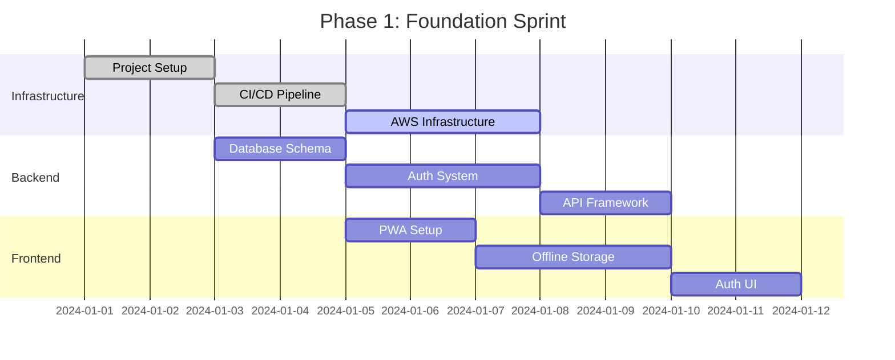
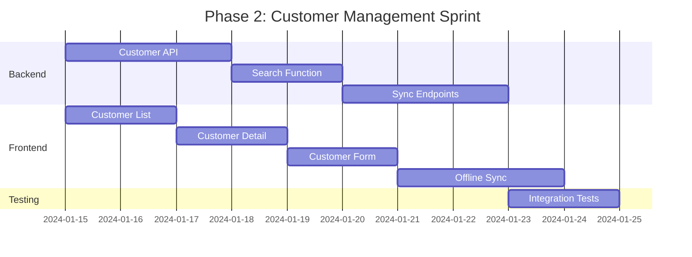
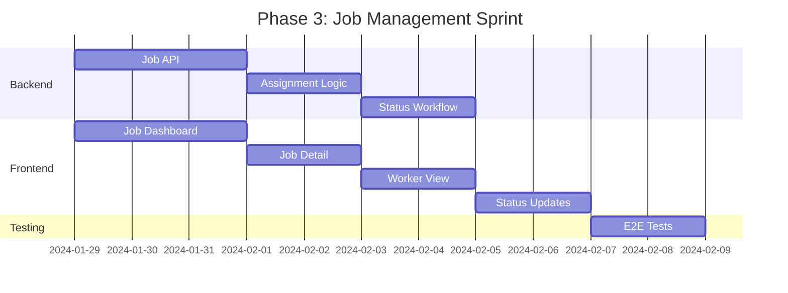
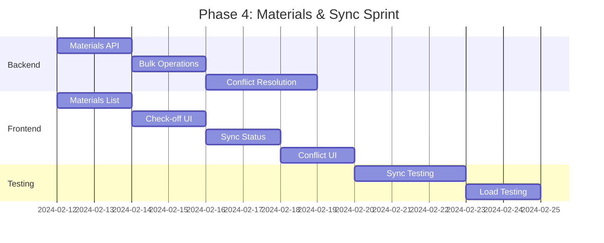
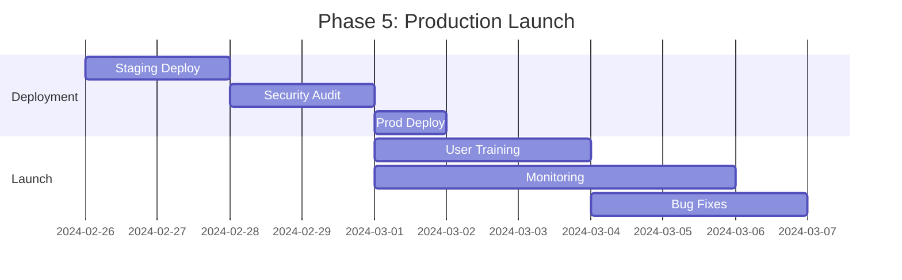
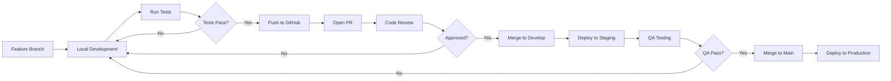

# Implementation Roadmap & Technical Decisions

## Executive Summary

This document outlines the implementation roadmap for the KHS Construction & Remodeling CRM, including development phases, technical decisions, risk mitigation strategies, and success metrics. The roadmap follows an iterative approach with early delivery of core functionality.

## Implementation Timeline

### Phase 1: Foundation (Weeks 1-3)

**Goal**: Establish core infrastructure and authentication system



**Deliverables**:
- Monorepo with TypeScript configuration
- CI/CD pipeline with automated testing
- AWS infrastructure (dev environment)
- JWT authentication with refresh tokens
- Role-based access control
- PWA shell with offline detection
- IndexedDB setup

**Success Criteria**:
- Developer can run full stack locally
- Authentication flow works end-to-end
- PWA installs on mobile devices
- Basic offline detection functional

### Phase 2: Customer Management (Weeks 4-6)

**Goal**: Implement core CRM functionality with offline sync



**Deliverables**:
- Customer CRUD operations
- Full-text search capability
- Customer list with pagination
- Customer detail/edit views
- Offline customer data access
- Basic sync functionality

**Success Criteria**:
- Create/edit customers offline
- Search works offline
- Changes sync when online
- No data loss scenarios

### Phase 3: Job Management (Weeks 7-9)

**Goal**: Build job tracking and assignment features



**Deliverables**:
- Job CRUD with status management
- Worker assignment system
- Owner dashboard view
- Worker task view
- Job status updates
- Offline job management

**Success Criteria**:
- Owner can manage all jobs
- Workers see only assigned jobs
- Status updates work offline
- Dashboard loads < 2 seconds

### Phase 4: Materials & Sync (Weeks 10-12)

**Goal**: Complete materials tracking and robust sync



**Deliverables**:
- Materials list management
- Check-off functionality
- Share/export materials lists
- Robust sync with conflict resolution
- Sync status indicators
- Performance optimization

**Success Criteria**:
- Materials work fully offline
- Conflicts resolved automatically
- Sync completes < 30 seconds
- Handles 500+ customers

### Phase 5: Production Launch (Weeks 13-14)

**Goal**: Deploy to production and onboard users



**Deliverables**:
- Production infrastructure
- Security hardening
- User documentation
- Training materials
- Monitoring dashboards
- Support process

**Success Criteria**:
- 99.9% uptime first week
- < 5 critical bugs
- User adoption > 80%
- Performance SLAs met

## Technical Decisions & Rationale

### Architecture Decisions

| Decision | Choice | Rationale | Alternatives Considered |
|----------|--------|-----------|------------------------|
| **Frontend Framework** | React 18 | - Mature ecosystem<br>- Strong PWA support<br>- Team familiarity<br>- Excellent TypeScript support | Vue 3: Less ecosystem<br>Angular: Too heavy<br>Svelte: Less mature |
| **State Management** | Zustand | - Simple API<br>- TypeScript friendly<br>- Lightweight (8KB)<br>- No boilerplate | Redux: Too complex<br>MobX: Learning curve<br>Context API: Limited features |
| **Offline Storage** | IndexedDB | - Large storage capacity<br>- Structured data<br>- Transaction support<br>- Wide browser support | localStorage: 10MB limit<br>WebSQL: Deprecated<br>Cache API: Not structured |
| **Backend Runtime** | Node.js | - JavaScript everywhere<br>- Huge ecosystem<br>- Fast development<br>- Good performance | Deno: Less mature<br>Python: Different language<br>Go: Steeper learning curve |
| **Database** | PostgreSQL | - ACID compliance<br>- JSON support<br>- Full-text search<br>- Proven reliability | MySQL: Less features<br>MongoDB: No transactions<br>DynamoDB: Vendor lock-in |
| **Deployment** | AWS ECS Fargate | - Serverless containers<br>- Auto-scaling<br>- No server management<br>- Cost effective | EC2: More management<br>Lambda: Cold starts<br>Kubernetes: Too complex |

### Key Technical Decisions

#### 1. Offline-First Architecture

**Decision**: Build offline-first from day one

**Rationale**:
- Construction sites often lack connectivity
- Better user experience (instant responses)
- Competitive advantage
- Reduces server load

**Implementation**:
- Service workers for request interception
- IndexedDB for structured data
- Optimistic UI updates
- Background sync queue

**Risks**:
- Complexity in sync logic
- Larger initial bundle size
- Browser compatibility issues

**Mitigation**:
- Extensive sync testing
- Progressive enhancement
- Fallback mechanisms

#### 2. Monorepo Structure

**Decision**: Single repository for all code

**Rationale**:
- Atomic commits across stack
- Shared TypeScript types
- Simplified dependency management
- Easier refactoring

**Implementation**:
- npm workspaces
- Shared packages
- Unified build process
- Single CI/CD pipeline

**Risks**:
- Large repository size
- Longer clone times
- Complex dependencies

**Mitigation**:
- Shallow clones for CI
- Careful dependency management
- Clear workspace boundaries

#### 3. JWT with Refresh Tokens

**Decision**: Stateless auth with short-lived access tokens

**Rationale**:
- Scalability (no server sessions)
- Security (short expiry)
- Mobile friendly
- Standard approach

**Implementation**:
- 15-minute access tokens
- 30-day refresh tokens
- Secure httpOnly cookies
- Automatic refresh

**Risks**:
- Token theft
- Refresh complexity
- Storage security

**Mitigation**:
- HTTPS everywhere
- Secure storage
- Token rotation
- Revocation capability

#### 4. Progressive Web App

**Decision**: PWA instead of native apps

**Rationale**:
- Single codebase
- No app store friction
- Instant updates
- Lower development cost

**Implementation**:
- Service workers
- Web manifest
- App shell architecture
- Push notifications

**Risks**:
- iOS limitations
- Less native features
- User perception

**Mitigation**:
- Feature detection
- Graceful degradation
- Clear install instructions
- Native-like UX

## Development Process

### Agile Methodology

```yaml
SprintStructure:
  Duration: 2 weeks
  Ceremonies:
    - Planning: Monday Week 1
    - Standup: Daily 9:00 AM
    - Review: Friday Week 2
    - Retrospective: Friday Week 2
    
TeamStructure:
  - ProductOwner: Defines requirements
  - TechLead: Architecture decisions
  - Developers: 2-3 full-stack
  - QA: Embedded in team
  
DefinitionOfDone:
  - Code reviewed
  - Tests written
  - Documentation updated
  - Deployed to staging
  - QA approved
  - Performance validated
```

### Development Workflow



### Code Quality Standards

```typescript
// Code quality configuration
{
  linting: {
    tool: 'ESLint',
    config: 'eslint-config-airbnb-typescript',
    rules: {
      'no-console': 'error',
      'no-unused-vars': 'error',
      'prefer-const': 'error',
      'max-lines': ['error', 300],
    },
  },
  
  formatting: {
    tool: 'Prettier',
    config: {
      semi: true,
      singleQuote: true,
      tabWidth: 2,
      trailingComma: 'all',
    },
  },
  
  testing: {
    coverage: {
      statements: 80,
      branches: 70,
      functions: 80,
      lines: 80,
    },
    types: ['unit', 'integration', 'e2e'],
  },
  
  documentation: {
    required: ['API', 'Components', 'Utilities'],
    tool: 'JSDoc + TypeDoc',
  },
}
```

## Risk Management

### Technical Risks

| Risk | Probability | Impact | Mitigation Strategy |
|------|-------------|---------|-------------------|
| **Offline sync conflicts** | High | High | - Comprehensive conflict resolution<br>- Extensive testing<br>- User notifications |
| **PWA limitations on iOS** | Medium | Medium | - Feature detection<br>- Fallback options<br>- Clear documentation |
| **Performance degradation** | Medium | High | - Performance budgets<br>- Continuous monitoring<br>- Optimization sprints |
| **Security vulnerabilities** | Low | Critical | - Regular audits<br>- Automated scanning<br>- Security updates |
| **Database scaling issues** | Low | High | - Read replicas<br>- Query optimization<br>- Caching strategy |

### Business Risks

| Risk | Probability | Impact | Mitigation Strategy |
|------|-------------|---------|-------------------|
| **User adoption resistance** | Medium | High | - Intuitive UI<br>- Comprehensive training<br>- Gradual rollout |
| **Scope creep** | High | Medium | - Clear MVP definition<br>- Change control process<br>- Regular stakeholder communication |
| **Budget overrun** | Medium | Medium | - Detailed estimation<br>- Regular tracking<br>- Contingency reserve |
| **Key person dependency** | Medium | High | - Knowledge sharing<br>- Documentation<br>- Pair programming |

## Success Metrics

### Technical Metrics

```yaml
Performance:
  - Initial Load: < 3 seconds on 4G
  - Time to Interactive: < 5 seconds
  - API Response Time: < 200ms (p95)
  - Offline Sync Time: < 30 seconds
  
Reliability:
  - Uptime: 99.9%
  - Error Rate: < 0.1%
  - Successful Sync Rate: > 99%
  - Data Loss Incidents: 0
  
Quality:
  - Code Coverage: > 80%
  - Bug Escape Rate: < 5%
  - Security Vulnerabilities: 0 critical
  - Technical Debt Ratio: < 5%
```

### Business Metrics

```yaml
Adoption:
  - User Activation Rate: > 90%
  - Daily Active Users: > 80%
  - Feature Adoption: > 70%
  - User Retention: > 95%
  
Efficiency:
  - Information Retrieval Time: -80%
  - Billable Hours Increase: +5-7 hours/week
  - Material Purchase Errors: -100%
  - Project Delays: -50%
  
Satisfaction:
  - User Satisfaction Score: > 4.5/5
  - Net Promoter Score: > 50
  - Support Tickets: < 5/week
  - Feature Requests: Tracked and prioritized
```

## Post-Launch Roadmap

### Phase 6: Enhancements (Months 4-6)

- Photo documentation feature
- Basic reporting dashboard
- Calendar integration
- Bulk data import/export
- Advanced search filters

### Phase 7: Integrations (Months 7-9)

- QuickBooks integration
- Google Maps integration
- SMS notifications
- Email automation
- Supplier catalogs

### Phase 8: Advanced Features (Months 10-12)

- AI-powered insights
- Predictive materials
- Route optimization
- Voice commands
- Multi-language support

## Conclusion

This implementation roadmap provides a clear path from concept to production for the KHS CRM. The phased approach allows for early value delivery while maintaining quality and managing risk. Regular checkpoints and metrics ensure the project stays on track and delivers the promised business value.

### Key Success Factors

1. **Early User Feedback**: Involve users from Phase 2
2. **Iterative Development**: Ship early and often
3. **Quality Focus**: Don't compromise on testing
4. **Performance Priority**: Monitor from day one
5. **Communication**: Regular stakeholder updates

### Next Steps

1. Finalize team composition
2. Set up development environment
3. Create detailed Phase 1 tasks
4. Schedule kickoff meeting
5. Begin implementation

The architecture and roadmap position the KHS CRM for successful delivery and long-term growth while addressing the specific needs of construction field workers.