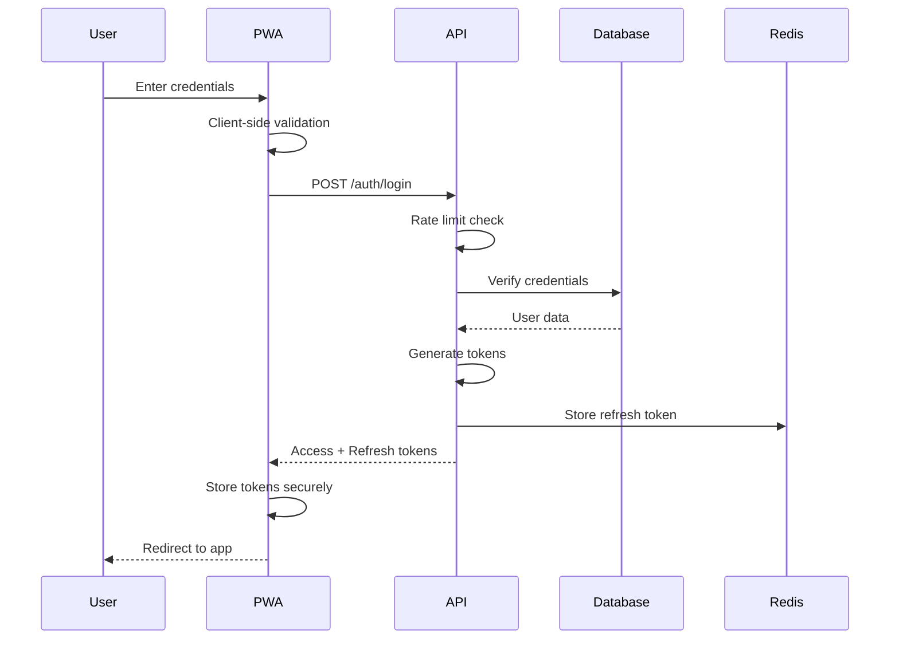

# Security & Authentication Architecture

## Overview

The KHS CRM implements defense-in-depth security with multiple layers of protection. The architecture prioritizes data protection, user privacy, and system integrity while maintaining usability for field workers in challenging environments.

## Security Principles

1. **Zero Trust**: Never trust, always verify
2. **Least Privilege**: Minimum necessary permissions
3. **Defense in Depth**: Multiple security layers
4. **Fail Secure**: Deny by default
5. **Security by Design**: Built-in, not bolted-on

## Authentication Architecture

### Authentication Flow



### Token Architecture

#### Access Token (JWT)
```typescript
interface AccessToken {
  // Header
  alg: 'RS256';          // RSA signature
  typ: 'JWT';
  kid: string;           // Key ID for rotation

  // Payload
  sub: string;           // User ID
  email: string;         // User email
  role: 'OWNER' | 'WORKER';
  permissions: string[]; // Granular permissions
  iat: number;          // Issued at
  exp: number;          // Expires (15 minutes)
  iss: 'khscrm.com';    // Issuer
  aud: 'khscrm-api';    // Audience
  jti: string;          // JWT ID for revocation
}
```

#### Refresh Token
```typescript
interface RefreshToken {
  id: string;            // Token ID
  userId: string;        // User reference
  clientId: string;      // Device/browser ID
  issuedAt: Date;
  expiresAt: Date;       // 30 days
  lastUsedAt: Date;
  ipAddress: string;
  userAgent: string;
}
```

### Password Security

```typescript
// Password requirements
const passwordPolicy = {
  minLength: 12,
  requireUppercase: true,
  requireLowercase: true,
  requireNumbers: true,
  requireSpecialChars: true,
  preventCommonPasswords: true,
  preventUserInfo: true,        // Not containing name/email
  preventRepeatingChars: true,   // No more than 2 repeating
  historyCount: 5,              // Can't reuse last 5 passwords
};

// Password hashing
async function hashPassword(password: string): Promise<string> {
  const saltRounds = 12;
  return bcrypt.hash(password, saltRounds);
}

// Password strength meter
function calculatePasswordStrength(password: string): PasswordStrength {
  let score = 0;
  
  // Length score
  score += Math.min(password.length * 4, 40);
  
  // Character variety
  if (/[a-z]/.test(password)) score += 10;
  if (/[A-Z]/.test(password)) score += 10;
  if (/[0-9]/.test(password)) score += 10;
  if (/[^a-zA-Z0-9]/.test(password)) score += 20;
  
  // Patterns (negative score)
  if (/(.)\1{2,}/.test(password)) score -= 10;
  if (/^[a-zA-Z]+$/.test(password)) score -= 10;
  if (/^[0-9]+$/.test(password)) score -= 10;
  
  return {
    score: Math.max(0, Math.min(100, score)),
    level: getStrengthLevel(score),
    feedback: getPasswordFeedback(password),
  };
}
```

### Multi-Factor Authentication (MFA)

```typescript
// TOTP implementation
class TOTPService {
  generateSecret(user: User): string {
    const secret = speakeasy.generateSecret({
      name: `KHS CRM (${user.email})`,
      issuer: 'KHS CRM',
      length: 32,
    });
    return secret.base32;
  }
  
  generateQRCode(secret: string, user: User): Promise<string> {
    const otpauth = speakeasy.otpauthURL({
      secret: secret,
      label: user.email,
      issuer: 'KHS CRM',
      encoding: 'base32',
    });
    
    return QRCode.toDataURL(otpauth);
  }
  
  verifyToken(secret: string, token: string): boolean {
    return speakeasy.totp.verify({
      secret: secret,
      encoding: 'base32',
      token: token,
      window: 2, // Allow 1 period before/after
    });
  }
}

// SMS backup codes
class BackupCodeService {
  generateCodes(count: number = 10): string[] {
    return Array.from({ length: count }, () => 
      crypto.randomBytes(4).toString('hex').toUpperCase()
    );
  }
  
  async verifyCode(userId: string, code: string): Promise<boolean> {
    const hashedCode = await this.hashCode(code);
    const valid = await db.backupCode.findFirst({
      where: {
        userId,
        code: hashedCode,
        usedAt: null,
      },
    });
    
    if (valid) {
      await db.backupCode.update({
        where: { id: valid.id },
        data: { usedAt: new Date() },
      });
      return true;
    }
    
    return false;
  }
}
```

## Authorization Architecture

### Role-Based Access Control (RBAC)

```typescript
// Permission model
enum Permission {
  // Customer permissions
  CUSTOMER_VIEW = 'customer:view',
  CUSTOMER_CREATE = 'customer:create',
  CUSTOMER_UPDATE = 'customer:update',
  CUSTOMER_DELETE = 'customer:delete',
  
  // Job permissions
  JOB_VIEW_ALL = 'job:view:all',
  JOB_VIEW_ASSIGNED = 'job:view:assigned',
  JOB_CREATE = 'job:create',
  JOB_UPDATE_ALL = 'job:update:all',
  JOB_UPDATE_ASSIGNED = 'job:update:assigned',
  JOB_DELETE = 'job:delete',
  JOB_ASSIGN = 'job:assign',
  
  // Material permissions
  MATERIAL_VIEW = 'material:view',
  MATERIAL_CREATE = 'material:create',
  MATERIAL_UPDATE = 'material:update',
  MATERIAL_DELETE = 'material:delete',
  
  // User permissions
  USER_VIEW = 'user:view',
  USER_CREATE = 'user:create',
  USER_UPDATE = 'user:update',
  USER_DELETE = 'user:delete',
}

// Role definitions
const rolePermissions: Record<Role, Permission[]> = {
  OWNER: [
    // All permissions
    ...Object.values(Permission),
  ],
  WORKER: [
    // Limited permissions
    Permission.CUSTOMER_VIEW,
    Permission.CUSTOMER_CREATE,
    Permission.JOB_VIEW_ASSIGNED,
    Permission.JOB_UPDATE_ASSIGNED,
    Permission.MATERIAL_VIEW,
    Permission.MATERIAL_CREATE,
    Permission.MATERIAL_UPDATE,
  ],
};

// Authorization middleware
function authorize(...requiredPermissions: Permission[]) {
  return (req: Request, res: Response, next: NextFunction) => {
    const userPermissions = rolePermissions[req.user.role];
    
    const hasPermission = requiredPermissions.every(permission =>
      userPermissions.includes(permission)
    );
    
    if (!hasPermission) {
      return res.status(403).json({
        error: {
          code: 'FORBIDDEN',
          message: 'Insufficient permissions',
          required: requiredPermissions,
        },
      });
    }
    
    next();
  };
}

// Row-level security
async function canAccessJob(userId: string, jobId: string, role: Role): Promise<boolean> {
  if (role === 'OWNER') return true;
  
  const assignment = await db.jobAssignment.findFirst({
    where: { userId, jobId },
  });
  
  return !!assignment;
}
```

### API Security

#### Request Validation

```typescript
// Input sanitization
import DOMPurify from 'isomorphic-dompurify';
import { z } from 'zod';

// Zod schema with sanitization
const customerSchema = z.object({
  name: z.string()
    .min(1)
    .max(255)
    .transform(val => DOMPurify.sanitize(val)),
  email: z.string()
    .email()
    .toLowerCase()
    .optional(),
  phone: z.string()
    .regex(/^\+?[\d\s-()]+$/)
    .transform(val => val.replace(/\D/g, ''))
    .optional(),
  address: z.string()
    .min(1)
    .max(500)
    .transform(val => DOMPurify.sanitize(val)),
  notes: z.string()
    .max(1000)
    .transform(val => DOMPurify.sanitize(val))
    .optional(),
});

// SQL injection prevention (via Prisma)
// Prisma automatically parameterizes queries
const customers = await prisma.customer.findMany({
  where: {
    name: {
      contains: userInput, // Safe - parameterized
    },
  },
});

// XSS prevention
function sanitizeOutput(data: any): any {
  if (typeof data === 'string') {
    return DOMPurify.sanitize(data);
  }
  if (Array.isArray(data)) {
    return data.map(sanitizeOutput);
  }
  if (typeof data === 'object' && data !== null) {
    return Object.fromEntries(
      Object.entries(data).map(([key, value]) => [key, sanitizeOutput(value)])
    );
  }
  return data;
}
```

#### Rate Limiting

```typescript
// Rate limiting configuration
const rateLimiters = {
  // Authentication endpoints
  login: rateLimit({
    windowMs: 60 * 1000,           // 1 minute
    max: 5,                        // 5 attempts
    skipSuccessfulRequests: true,  // Only count failures
    keyGenerator: (req) => req.ip + ':' + req.body.email,
  }),
  
  // API endpoints
  api: rateLimit({
    windowMs: 60 * 1000,           // 1 minute
    max: 100,                      // 100 requests
    keyGenerator: (req) => req.user?.id || req.ip,
  }),
  
  // Strict endpoints
  passwordReset: rateLimit({
    windowMs: 60 * 60 * 1000,      // 1 hour
    max: 3,                        // 3 attempts
    keyGenerator: (req) => req.body.email,
  }),
};

// Distributed rate limiting with Redis
class DistributedRateLimiter {
  async isAllowed(key: string, limit: number, window: number): Promise<boolean> {
    const now = Date.now();
    const windowStart = now - window;
    
    // Remove old entries
    await redis.zremrangebyscore(key, '-inf', windowStart);
    
    // Count current entries
    const count = await redis.zcard(key);
    
    if (count < limit) {
      // Add new entry
      await redis.zadd(key, now, `${now}-${Math.random()}`);
      await redis.expire(key, Math.ceil(window / 1000));
      return true;
    }
    
    return false;
  }
}
```

## Data Security

### Encryption

```typescript
// Encryption service
class EncryptionService {
  private algorithm = 'aes-256-gcm';
  private keyDerivationIterations = 100000;
  
  // Derive encryption key from password
  private async deriveKey(password: string, salt: Buffer): Promise<Buffer> {
    return new Promise((resolve, reject) => {
      crypto.pbkdf2(password, salt, this.keyDerivationIterations, 32, 'sha256', 
        (err, derivedKey) => {
          if (err) reject(err);
          else resolve(derivedKey);
        }
      );
    });
  }
  
  // Encrypt sensitive data
  async encrypt(text: string, password: string): Promise<EncryptedData> {
    const salt = crypto.randomBytes(16);
    const key = await this.deriveKey(password, salt);
    const iv = crypto.randomBytes(16);
    
    const cipher = crypto.createCipheriv(this.algorithm, key, iv);
    
    let encrypted = cipher.update(text, 'utf8', 'hex');
    encrypted += cipher.final('hex');
    
    const authTag = cipher.getAuthTag();
    
    return {
      encrypted,
      salt: salt.toString('hex'),
      iv: iv.toString('hex'),
      authTag: authTag.toString('hex'),
    };
  }
  
  // Decrypt sensitive data
  async decrypt(encryptedData: EncryptedData, password: string): Promise<string> {
    const salt = Buffer.from(encryptedData.salt, 'hex');
    const key = await this.deriveKey(password, salt);
    const iv = Buffer.from(encryptedData.iv, 'hex');
    const authTag = Buffer.from(encryptedData.authTag, 'hex');
    
    const decipher = crypto.createDecipheriv(this.algorithm, key, iv);
    decipher.setAuthTag(authTag);
    
    let decrypted = decipher.update(encryptedData.encrypted, 'hex', 'utf8');
    decrypted += decipher.final('utf8');
    
    return decrypted;
  }
}

// Field-level encryption for PII
@Entity()
class Customer {
  @PrimaryGeneratedColumn('uuid')
  id: string;
  
  @Column()
  name: string;
  
  @Column({ transformer: new EncryptionTransformer() })
  phone?: string;
  
  @Column({ transformer: new EncryptionTransformer() })
  email?: string;
  
  @Column()
  address: string;
  
  @Column({ type: 'text', nullable: true })
  notes?: string;
}
```

### Data Loss Prevention (DLP)

```typescript
// Sensitive data detection
class DLPService {
  private patterns = {
    ssn: /\b\d{3}-\d{2}-\d{4}\b/,
    creditCard: /\b\d{4}[\s-]?\d{4}[\s-]?\d{4}[\s-]?\d{4}\b/,
    email: /\b[A-Za-z0-9._%+-]+@[A-Za-z0-9.-]+\.[A-Z|a-z]{2,}\b/,
    phone: /\b\d{3}[-.]?\d{3}[-.]?\d{4}\b/,
  };
  
  detectSensitiveData(text: string): SensitiveDataMatch[] {
    const matches: SensitiveDataMatch[] = [];
    
    for (const [type, pattern] of Object.entries(this.patterns)) {
      const results = text.matchAll(new RegExp(pattern, 'g'));
      for (const match of results) {
        matches.push({
          type,
          value: match[0],
          position: match.index!,
        });
      }
    }
    
    return matches;
  }
  
  maskSensitiveData(text: string): string {
    let masked = text;
    
    // Mask SSN
    masked = masked.replace(this.patterns.ssn, (match) => 
      'XXX-XX-' + match.slice(-4)
    );
    
    // Mask credit card
    masked = masked.replace(this.patterns.creditCard, (match) => 
      '**** **** **** ' + match.slice(-4)
    );
    
    // Mask email
    masked = masked.replace(this.patterns.email, (match) => {
      const [username, domain] = match.split('@');
      return username[0] + '***@' + domain;
    });
    
    return masked;
  }
}
```

## Network Security

### HTTPS Configuration

```typescript
// Express HTTPS configuration
import https from 'https';
import fs from 'fs';

const httpsOptions = {
  key: fs.readFileSync('./certs/private-key.pem'),
  cert: fs.readFileSync('./certs/certificate.pem'),
  // Enforce TLS 1.2 minimum
  secureProtocol: 'TLSv1_2_method',
  ciphers: [
    'ECDHE-RSA-AES128-GCM-SHA256',
    'ECDHE-RSA-AES256-GCM-SHA384',
    'ECDHE-RSA-AES128-SHA256',
    'ECDHE-RSA-AES256-SHA384',
  ].join(':'),
  honorCipherOrder: true,
};

https.createServer(httpsOptions, app).listen(443);

// Force HTTPS redirect
app.use((req, res, next) => {
  if (!req.secure && req.get('X-Forwarded-Proto') !== 'https') {
    return res.redirect('https://' + req.get('Host') + req.url);
  }
  next();
});
```

### Security Headers

```typescript
// Helmet configuration
app.use(helmet({
  contentSecurityPolicy: {
    directives: {
      defaultSrc: ["'self'"],
      scriptSrc: ["'self'", "'unsafe-inline'", 'https://cdn.jsdelivr.net'],
      styleSrc: ["'self'", "'unsafe-inline'", 'https://fonts.googleapis.com'],
      fontSrc: ["'self'", 'https://fonts.gstatic.com'],
      imgSrc: ["'self'", 'data:', 'https:'],
      connectSrc: ["'self'", 'https://api.khscrm.com', 'wss://api.khscrm.com'],
      frameSrc: ["'none'"],
      objectSrc: ["'none'"],
      upgradeInsecureRequests: [],
    },
  },
  hsts: {
    maxAge: 31536000,
    includeSubDomains: true,
    preload: true,
  },
  referrerPolicy: { policy: 'strict-origin-when-cross-origin' },
  permissionsPolicy: {
    features: {
      geolocation: ["'self'"],
      camera: ["'self'"],
      microphone: ["'none'"],
      payment: ["'none'"],
    },
  },
}));

// Additional security headers
app.use((req, res, next) => {
  res.setHeader('X-Content-Type-Options', 'nosniff');
  res.setHeader('X-Frame-Options', 'DENY');
  res.setHeader('X-XSS-Protection', '1; mode=block');
  res.setHeader('X-Permitted-Cross-Domain-Policies', 'none');
  res.setHeader('Expect-CT', 'max-age=86400, enforce');
  res.setHeader('Feature-Policy', "geolocation 'self'; camera 'self'");
  next();
});
```

### CORS Configuration

```typescript
// CORS configuration
const corsOptions: CorsOptions = {
  origin: (origin, callback) => {
    const allowedOrigins = [
      'https://app.khscrm.com',
      'https://staging.khscrm.com',
    ];
    
    // Allow requests with no origin (mobile apps, Postman)
    if (!origin) return callback(null, true);
    
    if (allowedOrigins.includes(origin)) {
      callback(null, true);
    } else {
      callback(new Error('Not allowed by CORS'));
    }
  },
  credentials: true,
  methods: ['GET', 'POST', 'PUT', 'DELETE', 'OPTIONS'],
  allowedHeaders: ['Content-Type', 'Authorization', 'X-Requested-With'],
  exposedHeaders: ['X-Total-Count', 'X-Page', 'X-Per-Page'],
  maxAge: 86400, // 24 hours
};

app.use(cors(corsOptions));
```

## Session Security

### Session Management

```typescript
// Session configuration
const sessionConfig: SessionOptions = {
  name: 'khs_session',
  secret: process.env.SESSION_SECRET!,
  resave: false,
  saveUninitialized: false,
  cookie: {
    secure: true,              // HTTPS only
    httpOnly: true,           // No JS access
    maxAge: 30 * 24 * 60 * 60 * 1000, // 30 days
    sameSite: 'lax',          // CSRF protection
    domain: '.khscrm.com',    // All subdomains
  },
  store: new RedisStore({
    client: redis,
    prefix: 'sess:',
    ttl: 30 * 24 * 60 * 60,   // 30 days
  }),
};

// Session invalidation
async function invalidateAllUserSessions(userId: string): Promise<void> {
  const sessions = await redis.keys(`sess:*`);
  
  for (const key of sessions) {
    const session = await redis.get(key);
    if (session && JSON.parse(session).userId === userId) {
      await redis.del(key);
    }
  }
}

// Concurrent session limiting
async function enforceSessionLimit(userId: string, limit: number = 3): Promise<void> {
  const sessions = await getUserSessions(userId);
  
  if (sessions.length >= limit) {
    // Remove oldest sessions
    const toRemove = sessions
      .sort((a, b) => a.lastAccess - b.lastAccess)
      .slice(0, sessions.length - limit + 1);
    
    for (const session of toRemove) {
      await redis.del(`sess:${session.id}`);
    }
  }
}
```

## Audit & Compliance

### Audit Logging

```typescript
// Audit log service
class AuditLogger {
  async log(event: AuditEvent): Promise<void> {
    const entry: AuditLog = {
      id: uuid(),
      timestamp: new Date(),
      userId: event.userId,
      action: event.action,
      resource: event.resource,
      resourceId: event.resourceId,
      changes: event.changes,
      ipAddress: event.ipAddress,
      userAgent: event.userAgent,
      success: event.success,
      errorMessage: event.errorMessage,
    };
    
    // Store in database
    await db.auditLog.create({ data: entry });
    
    // Store in append-only log file
    await this.appendToFile(entry);
    
    // Alert on suspicious activity
    if (this.isSuspicious(entry)) {
      await this.alertSecurity(entry);
    }
  }
  
  private isSuspicious(entry: AuditLog): boolean {
    // Multiple failed login attempts
    if (entry.action === 'LOGIN' && !entry.success) {
      return this.checkFailedLogins(entry.userId, entry.ipAddress) > 5;
    }
    
    // Privilege escalation attempt
    if (entry.action === 'UPDATE_USER_ROLE') {
      return true;
    }
    
    // Mass data export
    if (entry.action === 'EXPORT_DATA' && entry.changes?.count > 1000) {
      return true;
    }
    
    return false;
  }
}

// Audit middleware
function auditMiddleware(action: string) {
  return async (req: Request, res: Response, next: NextFunction) => {
    const startTime = Date.now();
    
    // Capture original send
    const originalSend = res.send;
    let responseBody: any;
    
    res.send = function(data: any) {
      responseBody = data;
      return originalSend.call(this, data);
    };
    
    res.on('finish', async () => {
      await auditLogger.log({
        userId: req.user?.id,
        action,
        resource: req.route.path,
        resourceId: req.params.id,
        changes: req.method !== 'GET' ? req.body : undefined,
        ipAddress: req.ip,
        userAgent: req.get('User-Agent'),
        success: res.statusCode < 400,
        errorMessage: res.statusCode >= 400 ? responseBody : undefined,
        duration: Date.now() - startTime,
      });
    });
    
    next();
  };
}
```

### Compliance

```typescript
// GDPR compliance
class GDPRService {
  // Right to access
  async exportUserData(userId: string): Promise<UserDataExport> {
    const [user, customers, jobs, materials, auditLogs] = await Promise.all([
      db.user.findUnique({ where: { id: userId } }),
      db.customer.findMany({ where: { createdBy: userId } }),
      db.job.findMany({ where: { createdBy: userId } }),
      db.material.findMany({ where: { addedBy: userId } }),
      db.auditLog.findMany({ where: { userId } }),
    ]);
    
    return {
      user: this.sanitizeUser(user),
      customers,
      jobs,
      materials,
      auditLogs,
      exportedAt: new Date(),
    };
  }
  
  // Right to erasure
  async deleteUserData(userId: string): Promise<void> {
    // Anonymize rather than delete for data integrity
    await db.user.update({
      where: { id: userId },
      data: {
        email: `deleted-${userId}@example.com`,
        name: 'Deleted User',
        phone: null,
        isActive: false,
      },
    });
    
    // Delete personal data from related records
    await db.customer.updateMany({
      where: { createdBy: userId },
      data: { notes: null },
    });
  }
  
  // Cookie consent
  generateConsentCookie(consents: ConsentOptions): string {
    return jwt.sign(consents, process.env.CONSENT_SECRET!, {
      expiresIn: '1y',
    });
  }
}
```

## Security Testing

### Penetration Testing

```typescript
// Security test suite
describe('Security Tests', () => {
  describe('Authentication', () => {
    test('prevents brute force attacks', async () => {
      const attempts = Array(10).fill(null).map(() => 
        request(app)
          .post('/api/auth/login')
          .send({ email: 'test@example.com', password: 'wrong' })
      );
      
      const results = await Promise.all(attempts);
      const rateLimited = results.filter(r => r.status === 429);
      
      expect(rateLimited.length).toBeGreaterThan(0);
    });
    
    test('validates JWT signatures', async () => {
      const tamperedToken = validToken.replace(/.$/, 'X');
      
      const response = await request(app)
        .get('/api/customers')
        .set('Authorization', `Bearer ${tamperedToken}`);
      
      expect(response.status).toBe(401);
    });
  });
  
  describe('Input Validation', () => {
    test('prevents SQL injection', async () => {
      const response = await request(app)
        .get('/api/customers')
        .query({ search: "'; DROP TABLE customers; --" });
      
      expect(response.status).toBe(200);
      // Verify table still exists
      const customers = await db.customer.count();
      expect(customers).toBeGreaterThan(0);
    });
    
    test('prevents XSS attacks', async () => {
      const xssPayload = '<script>alert("XSS")</script>';
      
      const response = await request(app)
        .post('/api/customers')
        .send({
          name: xssPayload,
          address: '123 Main St',
        });
      
      const customer = await db.customer.findFirst({
        where: { name: { contains: 'script' } },
      });
      
      expect(customer).toBeNull();
    });
  });
});
```

### Security Monitoring

```typescript
// Real-time security monitoring
class SecurityMonitor {
  private alerts = new EventEmitter();
  
  async detectAnomalies(event: SecurityEvent): Promise<void> {
    // Unusual login location
    if (event.type === 'login') {
      const usual = await this.getUsualLocations(event.userId);
      if (!this.isNearby(event.location, usual)) {
        this.alerts.emit('unusual-location', event);
      }
    }
    
    // Rapid API calls
    if (event.type === 'api-call') {
      const rate = await this.getCallRate(event.userId);
      if (rate > 1000) { // 1000 calls per minute
        this.alerts.emit('api-abuse', event);
      }
    }
    
    // Data exfiltration
    if (event.type === 'data-export') {
      const volume = await this.getExportVolume(event.userId);
      if (volume > 10000) { // 10k records
        this.alerts.emit('data-exfiltration', event);
      }
    }
  }
  
  private async handleAlert(type: string, event: SecurityEvent): Promise<void> {
    // Log alert
    logger.security({
      level: 'alert',
      type,
      event,
    });
    
    // Notify security team
    await emailService.send({
      to: 'security@khscrm.com',
      subject: `Security Alert: ${type}`,
      body: JSON.stringify(event, null, 2),
    });
    
    // Auto-response for critical alerts
    if (type === 'data-exfiltration') {
      await this.blockUser(event.userId);
    }
  }
}
```

## Incident Response

### Incident Response Plan

```typescript
interface IncidentResponsePlan {
  detection: {
    monitoring: string[];
    alerts: AlertConfig[];
    thresholds: ThresholdConfig[];
  };
  
  containment: {
    immediate: Action[];
    shortTerm: Action[];
    longTerm: Action[];
  };
  
  eradication: {
    steps: Step[];
    validation: ValidationCheck[];
  };
  
  recovery: {
    steps: Step[];
    validation: ValidationCheck[];
    communication: CommunicationPlan;
  };
  
  postIncident: {
    review: ReviewProcess;
    improvements: Improvement[];
    documentation: Documentation;
  };
}

// Automated incident response
class IncidentResponder {
  async respond(incident: SecurityIncident): Promise<void> {
    // 1. Containment
    await this.contain(incident);
    
    // 2. Investigation
    const investigation = await this.investigate(incident);
    
    // 3. Eradication
    await this.eradicate(incident, investigation);
    
    // 4. Recovery
    await this.recover(incident);
    
    // 5. Post-incident
    await this.postIncident(incident, investigation);
  }
  
  private async contain(incident: SecurityIncident): Promise<void> {
    switch (incident.type) {
      case 'account-compromise':
        await this.lockAccount(incident.userId);
        await this.invalidateSessions(incident.userId);
        break;
        
      case 'data-breach':
        await this.blockIpAddress(incident.sourceIp);
        await this.revokeApiKeys(incident.apiKeyId);
        break;
        
      case 'malware':
        await this.isolateSystem(incident.systemId);
        break;
    }
  }
}
```