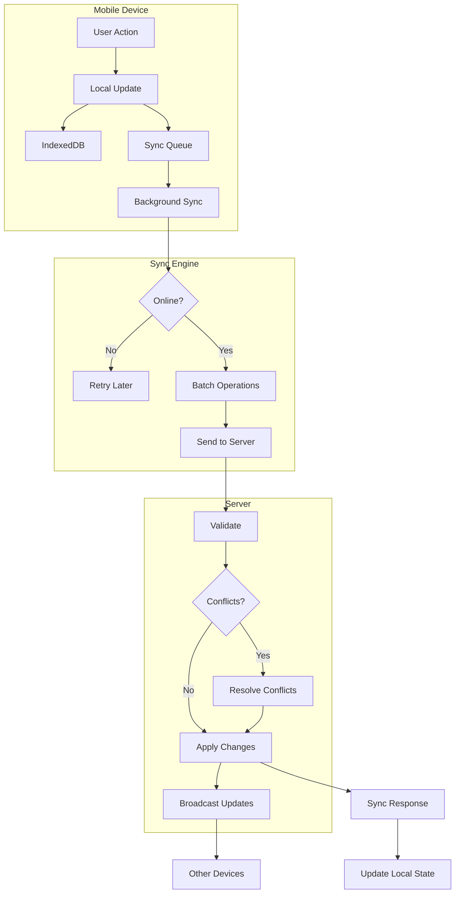

# Sync & Conflict Resolution Architecture

## Overview

The KHS CRM sync architecture enables reliable offline-first operation with automatic background synchronization when connectivity is restored. The system handles conflicts gracefully, prioritizing data integrity while minimizing user disruption.

## Sync Architecture Principles

1. **Optimistic Updates**: Local changes applied immediately
2. **Eventually Consistent**: All devices converge to same state
3. **Conflict Avoidance**: Design to minimize conflicts
4. **User Transparency**: Clear sync status and conflict notifications
5. **Data Integrity**: Never lose user data

## Sync System Architecture

### High-Level Sync Flow



### Sync Components

```typescript
// Sync system architecture
interface SyncSystem {
  // Local components
  localDB: IndexedDB;
  syncQueue: SyncQueue;
  conflictResolver: ConflictResolver;
  
  // Sync engine
  syncEngine: {
    scheduler: SyncScheduler;
    batcher: OperationBatcher;
    retry: RetryManager;
  };
  
  // Server components
  syncAPI: SyncAPI;
  changeTracker: ChangeTracker;
  broadcaster: UpdateBroadcaster;
}

// Sync operation structure
interface SyncOperation {
  id: string;                    // Client-generated UUID
  timestamp: number;             // Client timestamp
  type: 'create' | 'update' | 'delete';
  entity: 'customer' | 'job' | 'material';
  entityId?: string;             // For update/delete
  data?: any;                    // For create/update
  version?: number;              // For optimistic locking
  clientId: string;              // Device identifier
  userId: string;                // User who made change
}

// Sync metadata
interface SyncMetadata {
  lastSyncTime: Date;
  syncInProgress: boolean;
  pendingOperations: number;
  conflicts: ConflictRecord[];
  syncHistory: SyncHistoryEntry[];
}
```

## Offline Queue Management

### Queue Implementation

```typescript
// Sync queue with IndexedDB
class SyncQueue {
  private db: IDBDatabase;
  private readonly STORE_NAME = 'syncQueue';
  
  async enqueue(operation: SyncOperation): Promise<void> {
    const tx = this.db.transaction([this.STORE_NAME], 'readwrite');
    const store = tx.objectStore(this.STORE_NAME);
    
    // Add to queue with auto-incrementing ID
    await store.add({
      ...operation,
      queuedAt: Date.now(),
      retryCount: 0,
      status: 'pending',
    });
    
    // Trigger sync attempt
    await this.triggerSync();
  }
  
  async dequeue(batch: number = 50): Promise<QueuedOperation[]> {
    const tx = this.db.transaction([this.STORE_NAME], 'readonly');
    const store = tx.objectStore(this.STORE_NAME);
    const index = store.index('by-status-timestamp');
    
    // Get pending operations in order
    const operations = await index.getAll(
      IDBKeyRange.only('pending'),
      batch
    );
    
    return operations;
  }
  
  async markProcessed(operationIds: string[]): Promise<void> {
    const tx = this.db.transaction([this.STORE_NAME], 'readwrite');
    const store = tx.objectStore(this.STORE_NAME);
    
    for (const id of operationIds) {
      await store.delete(id);
    }
  }
  
  async markFailed(operationId: string, error: string): Promise<void> {
    const tx = this.db.transaction([this.STORE_NAME], 'readwrite');
    const store = tx.objectStore(this.STORE_NAME);
    
    const operation = await store.get(operationId);
    if (operation) {
      operation.retryCount++;
      operation.lastError = error;
      operation.nextRetryAt = this.calculateNextRetry(operation.retryCount);
      
      if (operation.retryCount > 3) {
        operation.status = 'failed';
      }
      
      await store.put(operation);
    }
  }
  
  private calculateNextRetry(attemptNumber: number): number {
    // Exponential backoff: 1s, 2s, 4s, 8s...
    const delayMs = Math.min(1000 * Math.pow(2, attemptNumber - 1), 30000);
    return Date.now() + delayMs;
  }
}
```

### Operation Batching

```typescript
// Intelligent operation batching
class OperationBatcher {
  batch(operations: SyncOperation[]): BatchedOperations {
    const batches: BatchedOperations = {
      creates: new Map(),
      updates: new Map(),
      deletes: new Map(),
    };
    
    for (const op of operations) {
      // Group by entity type for efficient processing
      const key = op.entity;
      
      switch (op.type) {
        case 'create':
          if (!batches.creates.has(key)) {
            batches.creates.set(key, []);
          }
          batches.creates.get(key)!.push(op);
          break;
          
        case 'update':
          // Merge multiple updates to same entity
          const existing = batches.updates.get(`${key}:${op.entityId}`);
          if (existing) {
            op.data = { ...existing.data, ...op.data };
            op.timestamp = Math.max(existing.timestamp, op.timestamp);
          }
          batches.updates.set(`${key}:${op.entityId}`, op);
          break;
          
        case 'delete':
          // Remove any creates/updates for deleted entities
          batches.creates.delete(`${key}:${op.entityId}`);
          batches.updates.delete(`${key}:${op.entityId}`);
          batches.deletes.set(`${key}:${op.entityId}`, op);
          break;
      }
    }
    
    return batches;
  }
  
  // Optimize operations to reduce conflicts
  optimize(operations: SyncOperation[]): SyncOperation[] {
    const optimized: SyncOperation[] = [];
    const seen = new Set<string>();
    
    // Process in reverse order (newest first)
    for (let i = operations.length - 1; i >= 0; i--) {
      const op = operations[i];
      const key = `${op.entity}:${op.entityId}`;
      
      // Skip if we've already seen a newer operation for this entity
      if (seen.has(key)) continue;
      
      seen.add(key);
      optimized.unshift(op);
    }
    
    return optimized;
  }
}
```

## Conflict Detection & Resolution

### Conflict Detection

```typescript
// Conflict detection strategies
class ConflictDetector {
  // Version-based conflict detection
  async detectVersionConflict(
    clientOp: SyncOperation,
    serverState: EntityState
  ): Promise<boolean> {
    if (!clientOp.version || !serverState.version) {
      return false; // No versioning, use timestamp
    }
    
    // Conflict if server version is higher than client's base version
    return serverState.version > clientOp.version;
  }
  
  // Timestamp-based conflict detection
  async detectTimestampConflict(
    clientOp: SyncOperation,
    serverState: EntityState
  ): Promise<boolean> {
    // Conflict if server was modified after client's operation
    return serverState.updatedAt > clientOp.timestamp;
  }
  
  // Field-level conflict detection
  async detectFieldConflicts(
    clientChanges: any,
    serverChanges: any,
    baseState: any
  ): Promise<FieldConflict[]> {
    const conflicts: FieldConflict[] = [];
    
    for (const field of Object.keys(clientChanges)) {
      if (field in serverChanges) {
        const clientValue = clientChanges[field];
        const serverValue = serverChanges[field];
        const baseValue = baseState[field];
        
        // Three-way merge detection
        if (clientValue !== serverValue && 
            clientValue !== baseValue && 
            serverValue !== baseValue) {
          conflicts.push({
            field,
            clientValue,
            serverValue,
            baseValue,
          });
        }
      }
    }
    
    return conflicts;
  }
}
```

### Conflict Resolution Strategies

```typescript
// Conflict resolution strategies
class ConflictResolver {
  async resolve(
    conflict: SyncConflict,
    strategy: ResolutionStrategy = 'SERVER_WINS'
  ): Promise<ResolvedConflict> {
    switch (strategy) {
      case 'SERVER_WINS':
        return this.serverWins(conflict);
        
      case 'CLIENT_WINS':
        return this.clientWins(conflict);
        
      case 'LAST_WRITE_WINS':
        return this.lastWriteWins(conflict);
        
      case 'ROLE_BASED':
        return this.roleBasedResolution(conflict);
        
      case 'FIELD_MERGE':
        return this.fieldLevelMerge(conflict);
        
      case 'USER_CHOICE':
        return this.userChoiceResolution(conflict);
        
      default:
        return this.serverWins(conflict);
    }
  }
  
  // Server state takes precedence
  private serverWins(conflict: SyncConflict): ResolvedConflict {
    return {
      resolution: 'server_wins',
      finalState: conflict.serverState,
      clientAction: 'update_local',
      userNotification: {
        type: 'info',
        message: 'Your changes were overwritten by newer updates',
      },
    };
  }
  
  // Client state takes precedence
  private clientWins(conflict: SyncConflict): ResolvedConflict {
    return {
      resolution: 'client_wins',
      finalState: conflict.clientState,
      clientAction: 'retry_sync',
      userNotification: null,
    };
  }
  
  // Most recent timestamp wins
  private lastWriteWins(conflict: SyncConflict): ResolvedConflict {
    const clientTime = conflict.clientOperation.timestamp;
    const serverTime = conflict.serverState.updatedAt;
    
    if (clientTime > serverTime) {
      return this.clientWins(conflict);
    } else {
      return this.serverWins(conflict);
    }
  }
  
  // Owner changes override worker changes
  private roleBasedResolution(conflict: SyncConflict): ResolvedConflict {
    const clientRole = conflict.clientOperation.userRole;
    const serverRole = conflict.serverState.lastModifiedByRole;
    
    // Owner always wins
    if (serverRole === 'OWNER' && clientRole === 'WORKER') {
      return this.serverWins(conflict);
    }
    
    if (clientRole === 'OWNER' && serverRole === 'WORKER') {
      return this.clientWins(conflict);
    }
    
    // Same role: use timestamp
    return this.lastWriteWins(conflict);
  }
  
  // Merge non-conflicting fields
  private fieldLevelMerge(conflict: SyncConflict): ResolvedConflict {
    const merged = { ...conflict.serverState };
    const conflicts: string[] = [];
    
    for (const [field, clientValue] of Object.entries(conflict.clientState)) {
      const serverValue = conflict.serverState[field];
      const baseValue = conflict.baseState?.[field];
      
      // No conflict: client modified, server didn't
      if (serverValue === baseValue && clientValue !== baseValue) {
        merged[field] = clientValue;
      }
      // Conflict: both modified differently
      else if (serverValue !== baseValue && 
               clientValue !== baseValue && 
               serverValue !== clientValue) {
        conflicts.push(field);
        // Server wins for conflicts
        merged[field] = serverValue;
      }
    }
    
    return {
      resolution: 'field_merge',
      finalState: merged,
      clientAction: conflicts.length > 0 ? 'update_local' : 'none',
      userNotification: conflicts.length > 0 ? {
        type: 'warning',
        message: `Conflicts in fields: ${conflicts.join(', ')}`,
        details: conflicts.map(field => ({
          field,
          yourValue: conflict.clientState[field],
          currentValue: conflict.serverState[field],
        })),
      } : null,
    };
  }
  
  // Present conflict to user for resolution
  private async userChoiceResolution(conflict: SyncConflict): Promise<ResolvedConflict> {
    // Store conflict for user resolution
    await this.storeConflictForUser(conflict);
    
    return {
      resolution: 'pending_user',
      finalState: conflict.serverState, // Use server state temporarily
      clientAction: 'show_conflict_ui',
      userNotification: {
        type: 'action_required',
        message: 'Sync conflict requires your attention',
        action: {
          label: 'Resolve Conflict',
          handler: 'openConflictResolver',
          payload: conflict.id,
        },
      },
    };
  }
}
```

### Special Case Handling

```typescript
// Material list conflict resolution
class MaterialConflictResolver {
  // Materials use union merge strategy
  async resolveMaterialConflicts(
    clientMaterials: Material[],
    serverMaterials: Material[]
  ): Promise<Material[]> {
    const merged = new Map<string, Material>();
    
    // Add all server materials
    for (const material of serverMaterials) {
      merged.set(material.id, material);
    }
    
    // Process client materials
    for (const clientMat of clientMaterials) {
      const serverMat = merged.get(clientMat.id);
      
      if (!serverMat) {
        // New material from client
        merged.set(clientMat.id, clientMat);
      } else {
        // Merge logic for existing materials
        merged.set(clientMat.id, {
          ...serverMat,
          // Purchase status: true wins (can't un-purchase)
          purchased: serverMat.purchased || clientMat.purchased,
          // Quantity: use maximum (assume additions)
          quantity: Math.max(serverMat.quantity, clientMat.quantity),
          // Notes: concatenate if different
          notes: this.mergeNotes(serverMat.notes, clientMat.notes),
          // Timestamp: use most recent
          updatedAt: Math.max(serverMat.updatedAt, clientMat.updatedAt),
        });
      }
    }
    
    return Array.from(merged.values());
  }
  
  private mergeNotes(serverNotes: string, clientNotes: string): string {
    if (!serverNotes) return clientNotes;
    if (!clientNotes) return serverNotes;
    if (serverNotes === clientNotes) return serverNotes;
    
    // Combine unique notes
    return `${serverNotes}\n---\n${clientNotes}`;
  }
}

// Job assignment conflict resolution
class JobAssignmentResolver {
  // Additive strategy for assignments
  async resolveAssignmentConflicts(
    clientAssignments: string[],
    serverAssignments: string[],
    operation: 'add' | 'remove' | 'replace'
  ): Promise<string[]> {
    const clientSet = new Set(clientAssignments);
    const serverSet = new Set(serverAssignments);
    
    switch (operation) {
      case 'add':
        // Union of both sets
        return Array.from(new Set([...clientSet, ...serverSet]));
        
      case 'remove':
        // Remove client removals from server set
        for (const id of clientSet) {
          serverSet.delete(id);
        }
        return Array.from(serverSet);
        
      case 'replace':
        // Owner wins for replacements
        return clientAssignments;
    }
  }
}
```

## Sync Protocol

### Sync API Design

```typescript
// Sync API endpoints
interface SyncAPI {
  // Push local changes
  push: {
    endpoint: '/api/sync/push';
    method: 'POST';
    request: {
      operations: SyncOperation[];
      lastSyncToken?: string;
      deviceId: string;
    };
    response: {
      processed: ProcessedOperation[];
      conflicts: SyncConflict[];
      syncToken: string;
    };
  };
  
  // Pull remote changes
  pull: {
    endpoint: '/api/sync/pull';
    method: 'GET';
    request: {
      lastSyncToken?: string;
      entities?: string[];
      limit?: number;
    };
    response: {
      changes: EntityChange[];
      deletions: EntityDeletion[];
      syncToken: string;
      hasMore: boolean;
    };
  };
  
  // Get sync status
  status: {
    endpoint: '/api/sync/status';
    method: 'GET';
    response: {
      serverTime: number;
      lastSync?: {
        deviceId: string;
        timestamp: number;
        syncToken: string;
      };
    };
  };
}

// Sync protocol implementation
class SyncProtocol {
  async performSync(): Promise<SyncResult> {
    try {
      // 1. Check sync status
      const status = await this.checkStatus();
      
      // 2. Push local changes
      const pushResult = await this.pushChanges();
      
      // 3. Handle conflicts
      if (pushResult.conflicts.length > 0) {
        await this.handleConflicts(pushResult.conflicts);
      }
      
      // 4. Pull remote changes
      const pullResult = await this.pullChanges(status.syncToken);
      
      // 5. Apply remote changes
      await this.applyRemoteChanges(pullResult.changes);
      
      // 6. Update sync metadata
      await this.updateSyncMetadata({
        lastSyncTime: new Date(),
        syncToken: pullResult.syncToken,
        processed: pushResult.processed.length,
        received: pullResult.changes.length,
      });
      
      return {
        success: true,
        processed: pushResult.processed.length,
        received: pullResult.changes.length,
        conflicts: pushResult.conflicts.length,
      };
    } catch (error) {
      return {
        success: false,
        error: error.message,
      };
    }
  }
  
  private async pushChanges(): Promise<PushResult> {
    const operations = await this.syncQueue.dequeue(100);
    
    if (operations.length === 0) {
      return { processed: [], conflicts: [] };
    }
    
    // Batch and optimize operations
    const optimized = this.batcher.optimize(operations);
    
    const response = await this.api.post('/api/sync/push', {
      operations: optimized,
      lastSyncToken: await this.getLastSyncToken(),
      deviceId: this.deviceId,
    });
    
    // Mark processed operations
    await this.syncQueue.markProcessed(
      response.processed.map(p => p.operationId)
    );
    
    return response;
  }
  
  private async pullChanges(sinceToken?: string): Promise<PullResult> {
    let allChanges: EntityChange[] = [];
    let hasMore = true;
    let currentToken = sinceToken;
    
    while (hasMore) {
      const response = await this.api.get('/api/sync/pull', {
        params: {
          lastSyncToken: currentToken,
          limit: 1000,
        },
      });
      
      allChanges = allChanges.concat(response.changes);
      hasMore = response.hasMore;
      currentToken = response.syncToken;
      
      // Apply changes in batches to avoid memory issues
      if (allChanges.length > 5000) {
        await this.applyRemoteChanges(allChanges);
        allChanges = [];
      }
    }
    
    return {
      changes: allChanges,
      syncToken: currentToken,
    };
  }
}
```

## Change Tracking

### Server-Side Change Tracking

```typescript
// Change tracking system
class ChangeTracker {
  // Track changes using triggers
  async setupTriggers(): Promise<void> {
    await this.db.raw(`
      CREATE OR REPLACE FUNCTION track_changes()
      RETURNS TRIGGER AS $$
      BEGIN
        INSERT INTO change_log (
          entity_type,
          entity_id,
          operation,
          user_id,
          changes,
          timestamp
        ) VALUES (
          TG_TABLE_NAME,
          NEW.id,
          TG_OP,
          current_setting('app.current_user_id'),
          to_jsonb(NEW),
          CURRENT_TIMESTAMP
        );
        RETURN NEW;
      END;
      $$ LANGUAGE plpgsql;
    `);
    
    // Apply to all tracked tables
    for (const table of ['customers', 'jobs', 'materials']) {
      await this.db.raw(`
        CREATE TRIGGER track_${table}_changes
        AFTER INSERT OR UPDATE OR DELETE ON ${table}
        FOR EACH ROW EXECUTE FUNCTION track_changes();
      `);
    }
  }
  
  // Get changes since last sync
  async getChangesSince(
    syncToken: string,
    entities?: string[]
  ): Promise<EntityChange[]> {
    const query = this.db('change_log')
      .where('timestamp', '>', this.decodeSyncToken(syncToken))
      .orderBy('timestamp', 'asc')
      .limit(1000);
    
    if (entities) {
      query.whereIn('entity_type', entities);
    }
    
    const changes = await query;
    
    // Group and deduplicate changes
    return this.deduplicateChanges(changes);
  }
  
  private deduplicateChanges(changes: RawChange[]): EntityChange[] {
    const latestChanges = new Map<string, RawChange>();
    
    for (const change of changes) {
      const key = `${change.entity_type}:${change.entity_id}`;
      const existing = latestChanges.get(key);
      
      if (!existing || change.timestamp > existing.timestamp) {
        latestChanges.set(key, change);
      }
    }
    
    return Array.from(latestChanges.values()).map(this.formatChange);
  }
}
```

### Client-Side Change Tracking

```typescript
// Client-side change observer
class ChangeObserver {
  private observers = new Map<string, MutationCallback>();
  
  observe(entity: string, callback: MutationCallback): void {
    this.observers.set(entity, callback);
  }
  
  async notifyChange(
    entity: string,
    operation: 'create' | 'update' | 'delete',
    data: any
  ): Promise<void> {
    // Create sync operation
    const syncOp: SyncOperation = {
      id: uuidv4(),
      timestamp: Date.now(),
      type: operation,
      entity,
      entityId: data.id,
      data: operation !== 'delete' ? data : undefined,
      version: data.version,
      clientId: this.deviceId,
      userId: this.currentUser.id,
    };
    
    // Queue for sync
    await this.syncQueue.enqueue(syncOp);
    
    // Notify observers
    const callback = this.observers.get(entity);
    if (callback) {
      callback(syncOp);
    }
    
    // Update UI optimistically
    await this.updateLocalState(syncOp);
  }
  
  private async updateLocalState(operation: SyncOperation): Promise<void> {
    const store = this.getStore(operation.entity);
    
    switch (operation.type) {
      case 'create':
        await store.add(operation.data);
        break;
        
      case 'update':
        await store.update(operation.entityId, operation.data);
        break;
        
      case 'delete':
        await store.delete(operation.entityId);
        break;
    }
  }
}
```

## Performance Optimization

### Differential Sync

```typescript
// Differential sync for large datasets
class DifferentialSync {
  async syncEntity(
    entity: string,
    lastSync: Date
  ): Promise<SyncResult> {
    // Get local changes
    const localChanges = await this.getLocalChanges(entity, lastSync);
    
    // Get checksums for efficient comparison
    const localChecksums = await this.calculateChecksums(entity);
    const remoteChecksums = await this.api.get(`/api/sync/checksums/${entity}`);
    
    // Find differences
    const diff = this.compareChecksums(localChecksums, remoteChecksums);
    
    // Sync only differences
    if (diff.missing.length > 0) {
      await this.pullEntities(entity, diff.missing);
    }
    
    if (diff.extra.length > 0) {
      await this.pushEntities(entity, diff.extra);
    }
    
    if (diff.different.length > 0) {
      await this.syncDifferent(entity, diff.different);
    }
    
    return {
      pulled: diff.missing.length,
      pushed: diff.extra.length,
      updated: diff.different.length,
    };
  }
  
  private async calculateChecksums(entity: string): Promise<ChecksumMap> {
    const items = await this.db.getAll(entity);
    const checksums = new Map<string, string>();
    
    for (const item of items) {
      const hash = this.hashObject(item);
      checksums.set(item.id, hash);
    }
    
    return checksums;
  }
  
  private hashObject(obj: any): string {
    // Sort keys for consistent hashing
    const sorted = JSON.stringify(obj, Object.keys(obj).sort());
    return crypto.createHash('sha256').update(sorted).digest('hex');
  }
}
```

### Sync Compression

```typescript
// Compress sync payloads
class SyncCompression {
  async compressPayload(data: any): Promise<CompressedPayload> {
    const json = JSON.stringify(data);
    
    // Use Brotli for best compression
    const compressed = await new Promise<Buffer>((resolve, reject) => {
      zlib.brotliCompress(json, (err, result) => {
        if (err) reject(err);
        else resolve(result);
      });
    });
    
    // Only use compressed if smaller
    if (compressed.length < json.length * 0.8) {
      return {
        encoding: 'br',
        data: compressed.toString('base64'),
        originalSize: json.length,
        compressedSize: compressed.length,
      };
    }
    
    return {
      encoding: 'none',
      data: json,
      originalSize: json.length,
      compressedSize: json.length,
    };
  }
  
  async decompressPayload(payload: CompressedPayload): Promise<any> {
    if (payload.encoding === 'none') {
      return JSON.parse(payload.data);
    }
    
    const compressed = Buffer.from(payload.data, 'base64');
    
    const decompressed = await new Promise<Buffer>((resolve, reject) => {
      zlib.brotliDecompress(compressed, (err, result) => {
        if (err) reject(err);
        else resolve(result);
      });
    });
    
    return JSON.parse(decompressed.toString());
  }
}
```

## Monitoring & Debugging

### Sync Analytics

```typescript
// Sync performance monitoring
class SyncAnalytics {
  async trackSyncOperation(operation: SyncOperation): Promise<void> {
    await this.db.syncMetrics.create({
      timestamp: new Date(),
      operation: operation.type,
      entity: operation.entity,
      duration: operation.duration,
      success: operation.success,
      dataSize: operation.dataSize,
      conflictCount: operation.conflicts?.length || 0,
      errorMessage: operation.error,
      deviceId: this.deviceId,
      userId: this.userId,
    });
    
    // Alert on anomalies
    if (operation.duration > 30000) { // 30 seconds
      await this.alertSlowSync(operation);
    }
    
    if (operation.conflicts && operation.conflicts.length > 10) {
      await this.alertHighConflicts(operation);
    }
  }
  
  async getSyncHealth(): Promise<SyncHealthReport> {
    const recentSyncs = await this.db.syncMetrics.findMany({
      where: {
        timestamp: { gte: new Date(Date.now() - 24 * 60 * 60 * 1000) },
      },
    });
    
    return {
      successRate: this.calculateSuccessRate(recentSyncs),
      averageDuration: this.calculateAverageDuration(recentSyncs),
      conflictRate: this.calculateConflictRate(recentSyncs),
      dataVolume: this.calculateDataVolume(recentSyncs),
      recommendations: this.generateRecommendations(recentSyncs),
    };
  }
}

// Sync debugging tools
class SyncDebugger {
  async captureSync Session(): Promise<SyncDebugSession> {
    const session = {
      id: uuidv4(),
      startTime: Date.now(),
      operations: [],
      conflicts: [],
      errors: [],
      networkRequests: [],
    };
    
    // Intercept sync operations
    this.syncEngine.on('operation', (op) => {
      session.operations.push({
        ...op,
        timestamp: Date.now() - session.startTime,
      });
    });
    
    // Capture network requests
    this.interceptNetwork((req, res) => {
      session.networkRequests.push({
        url: req.url,
        method: req.method,
        requestBody: req.body,
        responseStatus: res.status,
        responseBody: res.body,
        duration: res.duration,
      });
    });
    
    return session;
  }
  
  async exportDebugLog(): Promise<string> {
    const log = {
      deviceInfo: await this.getDeviceInfo(),
      syncHistory: await this.getSyncHistory(),
      pendingOperations: await this.getPendingOperations(),
      conflicts: await this.getUnresolvedConflicts(),
      localStorage: await this.getLocalStorageSnapshot(),
      errorLog: await this.getErrorLog(),
    };
    
    return JSON.stringify(log, null, 2);
  }
}
```

## Best Practices

### Conflict Avoidance Patterns

```typescript
// Design patterns to minimize conflicts

// 1. Partition data by user
interface UserPartitionedData {
  // Each user owns their created records
  createdBy: string;
  // Only creator can modify
  canModify: (userId: string) => boolean;
}

// 2. Use append-only for shared data
interface AppendOnlyList<T> {
  items: T[];
  // Never modify existing items
  append: (item: T) => void;
  // Soft delete only
  markDeleted: (id: string) => void;
}

// 3. Separate shared and private fields
interface SeparatedFields {
  // Shared fields (conflict-prone)
  shared: {
    title: string;
    status: string;
  };
  
  // User-specific fields (no conflicts)
  userSpecific: {
    [userId: string]: {
      notes: string;
      lastViewed: Date;
    };
  };
}

// 4. Use CRDTs for collaborative fields
class CRDTCounter {
  private counts = new Map<string, number>();
  
  increment(userId: string, amount: number = 1): void {
    const current = this.counts.get(userId) || 0;
    this.counts.set(userId, current + amount);
  }
  
  getValue(): number {
    return Array.from(this.counts.values()).reduce((a, b) => a + b, 0);
  }
  
  merge(other: CRDTCounter): void {
    for (const [userId, count] of other.counts) {
      const current = this.counts.get(userId) || 0;
      this.counts.set(userId, Math.max(current, count));
    }
  }
}
```